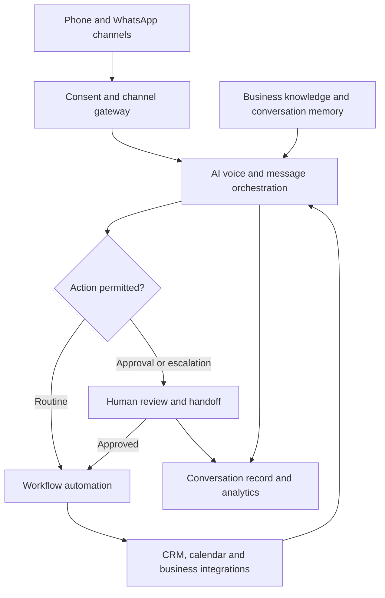

# BizMaster AI Agent Next.js Website Specification

**Prepared:** 7 October 2026  
**Purpose:** A complete content, design, CSS, and implementation brief for a new BizMaster AI Call Agent and WhatsApp Communication Platform website.  
**Primary source:** `BIZ AI call Agent(1).docx`, version 2.0.  
**Brand reference:** [BizMaster Solutions](https://bizmastersolutions.lk/).  
**Deliverable scope:** This file specifies the website to build. It includes implementation examples and the complete source requirements inventory. It does not represent an already deployed website or a working telephony service.

## 1. Project decision and document analysis

Build a dedicated product website for **BizMaster AI Agent**, owned by **BizMaster Solutions — Tech Hub Division**. Retain the existing company's logo and verified purple colour, and create a new visual design, page structure, and custom CSS.

The supplied document is a product and business architecture specification, rather than a website brief. It contains 25 principal sections, 13 communication modules, three operating roles, WhatsApp product packages, enterprise capabilities, customer segments, security commitments, integrations, and measurement targets. Translate that material into clear pages for buyers, with deeper feature details available on dedicated routes.

The recommended launch is a public marketing website with a working demo-request form, pricing enquiry journey, industry pages, and a clearly labelled interactive product preview. The operational admin platform is a separate phase. Describing a call feature on a page does not implement the underlying call service.

### 1.1 Evidence labels

| Label | Meaning | Implementation rule |
| --- | --- | --- |
| Verified brand | Observed in the supplied live website's HTML, stylesheet, or original logo | Use these colours and the identified logo asset |
| Source requirement | Stated in the supplied DOCX | Preserve in the product inventory; confirm availability before advertising it as live |
| New design proposal | Created for this website brief | Implement as the proposed design |
| Confirmation needed | Conflicting, incomplete, or unsupported source claim | Keep an explicit internal flag; use careful public wording |
| Later platform phase | Requires authenticated operations or provider integrations | Keep separate from the marketing website launch |

### 1.2 Conflicts and publication decisions

| Source issue | What the file says | Required website treatment |
| --- | --- | --- |
| Product names | Agent BIZ MASTER, Agent BIZ Master, and Agent Dilu are interchanged | Public product: **BizMaster AI Agent**. WhatsApp offering: **Agent BIZ MASTER**. Explain Agent Dilu only as a verified underlying integration |
| Provider attribution | Agent Dilu is attributed to Dilexus, described as a Meta Tech Provider | Obtain approved attribution and provider evidence before publishing partner status; do not imply BizMaster itself is a Meta partner |
| Pricing range | Section 22 lists Rs. 8,000–70,000; section 18.7 lists Pro Voice at Rs. 100,000 | Use the explicit plan table as the draft data; flag pricing for commercial confirmation; discard the conflicting range from public copy |
| Setup charges | WhatsApp copy says zero setup fees; general pricing includes setup and integration fees | Define no-setup terms only for eligible WhatsApp plans if confirmed; quote custom deployments separately |
| Meta charging model | The DOCX says per-conversation pass-through fees | Current official WhatsApp pricing describes delivered-message charging by market and category. Separate Meta charges from the business's own AI-managed chat allowance [S5] |
| Reply speed | WhatsApp target is under 5 seconds; Agent Dilu target is under 10 seconds | Track both as distinct source targets; publish measured results only after defining the measurement |
| Latency | Sub-200 ms voice latency is asserted | Do not equate this with complete end-to-end voice response time; define measurement boundaries and validate before publishing |
| Capacity and availability | 100% answer rate, zero wait, 100+ concurrent calls, 1,000+ outbound calls per day | Treat as targets or source capacity claims until load testing, provider limits, and the SLA support them |
| Market claims | Sri Lanka's first, 60% after-hours inquiries, replacement of fixed numbers of staff | Keep out of published marketing until evidence exists; emphasize supporting staff and reducing repetitive work |
| Security | AWS, KMS, Bedrock, MFA, residency, dedicated deployment, and no-training promises | Publish only controls implemented across the full provider chain and supported by current contracts |
| Trial eligibility | No card, 5-minute launch, no hidden charges, 2-week trial | State conditions precisely after confirmation; do not invent instant provisioning or an external sign-up destination |
| AI-managed chats | Plan allowances use this phrase without a counting definition | Add a billing definition before purchase; distinguish chats, individual messages, voice notes, and provider charges |

The appendix preserves source material for completeness. Its claims remain source statements, not independent verification. This conflict table governs the new website's public wording where the original inventory disagrees.

## 2. Goals and audience

The website should help a visitor understand the product, identify a relevant workflow, compare appropriate plans, and request a demo with enough information for a useful response.

Primary conversion: **Book a Demo**. Secondary conversion: **Explore Plans**. WhatsApp enquiry is an additional contact path using a verified business number. Enterprise and white-label buyers use **Talk to Sales**.

| Audience | Main need | Best initial journey |
| --- | --- | --- |
| SMEs and owner-managed businesses | Answer calls and WhatsApp while serving existing customers | Home → inbound or WhatsApp → pricing → demo |
| Sales teams, property businesses, insurers | Qualification, follow-ups, appointments, renewals | Sales role → outbound and follow-ups → industry → demo |
| Clinics, hotels, restaurants, service companies | Bookings, routine questions, reminders | Industry → relevant modules → demo |
| Support teams and call centres | Overflow, queues, routing, QA, handoff | Call centre role → operations → security → sales enquiry |
| BPOs, agencies, institutions | White-label, multilingual, multiple teams | Enterprise → integrations → sales enquiry |
| Executives and professionals | Screening, scheduling, messages, personal reminders | Personal assistant role → features → enquiry |

Position AI as support for people: it handles repeat questions, first responses, and scheduled follow-ups; staff manage sensitive decisions, complex issues, relationships, and negotiations.

## 3. Verified brand colours and original logo

Brand inspection was performed on 7 October 2026. The following base values were read from the live site's stylesheet and inline styles, rather than guessed from a screenshot.

### 3.1 Brand palette

| Token role | Verified colour | Observed source or role | New design use |
| --- | --- | --- | --- |
| Primary purple | `#5D0E8B` | `--primary`, `--accent`, headings, footer | Primary buttons, brand blocks, navigation |
| Deep purple | `#4A0B70` | Mobile navigation background | Hover states and deep brand surfaces |
| White | `#FFFFFF` | Background and primary foreground | Light pages, text over purple |
| Black | `#000000` | Foreground and hero gradient start | High-contrast headings and hero base |
| Card grey | `#F8F9FA` | `--card` and sidebar | Card surfaces and alternating sections |
| Neutral grey | `#F5F5F5` | `--secondary` and `--muted` | Supporting panels |
| Body grey | `#666666` | `--muted-foreground` | Secondary text on light backgrounds |
| Border grey | `#E5E5E5` | `--border` | Decorative dividers and card edges |
| Light purple | `#F3E8FF` | Sidebar accent | Module icons and selected chips |
| Dark surface | `#1A1A1A` | Dark inputs and sidebar | Dark cards and preview surfaces |
| Dark divider | `#333333` | Dark borders and secondary surfaces | Dark layout structure |
| Light grey text | `#CCCCCC` | Dark muted foreground | Supporting copy on dark panels |
| WhatsApp green | `#25D366` | WhatsApp control's coloured glow | Small channel indicator; use darker green behind white button text |
| WhatsApp deep green | `#075E54` | WhatsApp contact label | Accessible WhatsApp CTA background |

Derived colours introduced for the new design are `#E6C6FF` for links on dark surfaces and `#B67BE0` for purple focus outlines on dark backgrounds. These are **new accessibility and design extensions**, not verified brand values.

Do not treat every utility colour in the site's stylesheet as a brand colour. Red, amber, and green can indicate semantic states; they are not replacements for purple in the brand system.

### 3.2 Logo identity and handling

- Original asset: [BizMaster logo PNG](https://bizmastersolutions.lk/nw_logo.png).
- Source image: **1676 × 1676 px**, RGBA with transparency.
- Visible artwork bounding box, using Pillow's right/bottom-exclusive coordinates: **(45, 575, 1601, 1087)**. Much of the image is transparent padding.
- The artwork is a white BizMaster Solutions wordmark and symbol. It requires a dark or purple background.
- Retain the original logo design and proportions. Do not generate a replacement, redraw the logo, tint it purple, or invent an alternative official brand mark.
- For a compact header, trim only transparent margins into a local derivative with a small padding allowance. A padded crop at `(25, 555, 1621, 1107)` is **1596 × 552 px** and leaves the original artwork unchanged.
- Store the original as `/public/brand/bizmaster-logo-original.png`; store the transparent-margin crop as `/public/brand/bizmaster-logo-white.png`.
- Use the cropped derivative around 180–200 px wide on desktop and 150–165 px on mobile. Reserve its true aspect ratio to avoid layout shift.
- Give the logo link an accessible label such as `BizMaster Solutions home`; when that label is on the link, the image itself can use empty alt text to avoid duplication.
- Place the white logo over the purple header and footer in both themes. A light header requires an approved dark logo; the launch design deliberately uses a purple header.
- Do not crop the full wordmark into a favicon. Request an approved icon asset, or use a temporary neutral site icon identified as temporary.

Asset preparation example, to run when implementing the site:

```python
from pathlib import Path
from urllib.request import urlopen
from PIL import Image

brand_dir = Path("public/brand")
brand_dir.mkdir(parents=True, exist_ok=True)
original = brand_dir / "bizmaster-logo-original.png"
with urlopen("https://bizmastersolutions.lk/nw_logo.png", timeout=30) as response:
    original.write_bytes(response.read())
image = Image.open(original).convert("RGBA")
image.crop((25, 555, 1621, 1107)).save(brand_dir / "bizmaster-logo-white.png")
```

Use downloaded local assets rather than depending on another website's asset uptime. Recheck the crop if the upstream logo changes. The specification contains the source URL; a working site's logo must be copied into its own project.

## 4. New visual design direction

Create a professional communication-product website with three recurring visual elements: a purple brand header, generous light reading sections, and a dark conversation preview. This is an original composition built from BizMaster's brand palette.

### 4.1 Layout and typography

| Item | Design requirement |
| --- | --- |
| Content width | 1200 px maximum; 24 px desktop gutters; 16 px mobile gutters |
| Header | Sticky, 76 px minimum, purple; logo left, navigation centre, CTA right |
| Hero | Two columns at desktop, text 55% and preview 45%; single column below 1024 px |
| Desktop hero title | Fluid 46–76 px, weight 700, compact line height around 1.07 |
| Section title | Fluid 30–46 px, line height around 1.15 |
| Body | Inter, 16–18 px, line height 1.65; paragraphs up to 65 characters wide |
| Local language fallback | Noto Sans Sinhala and Noto Sans Tamil when those locales are provided |
| Spacing | 4, 8, 12, 16, 24, 32, 48, 64, 80, 112 px scale |
| Sections | 80–112 px vertical padding desktop; 48–64 px mobile |
| Cards | 18–24 px corner radius, fine borders, restrained shadow |
| Controls | At least 44 × 44 px targets, strong focus indicators, readable labels |
| Icons | One consistent stroke icon set; no emoji as the main professional icon system |
| Motion | 150–220 ms hover transitions; only subtle reveal or transcript progression |

Avoid visual clutter, perpetual animated pulses, auto-playing audio, scattered floating widgets, and excessive decorative gradients. One background gradient in the hero and a quiet transcript animation are sufficient.

### 4.2 Hero art direction

Use a CSS-built conversation preview, not a stock robot photograph. A large dark frame contains channel chips for phone, WhatsApp, and follow-up; a fictional transcript; a clear action summary; and a small handoff card. Label the frame **Illustrative demo**.

The interaction shows an enquiry becoming a booking or a qualified lead. A purple timeline can connect four stages vertically: received, understood, action prepared, handed over. Do not display fabricated operational statistics without a demo label.

### 4.3 Theme behaviour

Launch with a light reading theme and dark hero preview. An optional Light/Dark/System selector can switch page surfaces while preserving the purple brand header. Store the chosen preference locally. Apply the preference before hydration to avoid a theme flash, using a CSP-compatible initializer or a suitable theme package. Theme toggles must have text labels or accessible names.

Dark-theme links use light purple. Purple `#5D0E8B` must not be used as small text directly over near-black backgrounds because that combination needs contrast review.

## 5. Information architecture and route map

The recommended site is a dedicated product experience. A clearly labelled **Company website** link goes to the existing corporate website. Do not expand the scope to unrelated corporate services unless separately requested.

| Route | Purpose | Main content | Main action |
| --- | --- | --- | --- |
| `/` | Product introduction | Roles, modules, preview, industries, plans, trust, FAQ | Book a Demo |
| `/platform` | How the platform works | Channels, shared knowledge, workflows, CRM, handoff | Discuss My Workflow |
| `/features` | Full feature catalogue | All 13 modules, filtering, benefits | View Module |
| `/features/[slug]` | Detailed module | Use cases, steps, features, handoff, integrations | Request This Demo |
| `/solutions/call-center` | Call centre role | Inbound, queues, QA, routing, multi-site | Book a Demo |
| `/solutions/sales-agent` | Sales role | Qualification, pitch, quotation, pipeline | Book a Demo |
| `/solutions/personal-assistant` | Personal role | Screening, messages, calendar, reminders | Discuss My Setup |
| `/whatsapp-ai` | Agent BIZ MASTER | Chat, voice, notes, templates, phones, PBX, plans | Explore WhatsApp Plans |
| `/industries` | Buyer segments | Searchable industry cards | Explore Industry |
| `/industries/[slug]` | Industry workflow | Problems, mapped modules, fictional scenario | Request Industry Demo |
| `/integrations` | Systems and channels | Categories, connection approaches, availability | Check Compatibility |
| `/pricing` | Plan comparison | Chat and voice packages, enterprise enquiries, terms | Enquire About Plan |
| `/enterprise` | Custom and white-label | Deployment options, controls, SLA discussions | Talk to Sales |
| `/security` | Trust and human control | Confirmed controls, consent, handoff, retention | Request Security Pack |
| `/about` | Product ownership | Tech Hub division, purpose, operating approach | Contact Team |
| `/contact` | General enquiries | Verified details, contact form, WhatsApp | Send Enquiry |
| `/book-demo` | Qualified conversion | Demo request form with contextual defaults | Request Demo |
| `/thank-you` | Confirmation | Genuine submission receipt and next steps | Return to Product |
| `/privacy` | Approved privacy notice | Data processing, contact, rights, retention | Contact Privacy Team |
| `/terms` | Approved service terms | Usage, billing, limitations, cancellation | Contact Team |
| `/cookies` | Cookie explanation | Essential and optional tools, preferences | Update Preferences |
| `/demo` | Optional guided preview | Fictional channels and workflows | Request Live Demo |
| `/dashboard/*` | Later authenticated phase | Tenant-specific operational screens | Contextual actions |

Routes without approved content should stay out of navigation and sitemap until ready. Do not expose an empty public page to satisfy a route list.

### 5.1 Feature slugs

`inbound-calls`, `outbound-calls`, `whatsapp-messaging`, `whatsapp-voice`, `follow-ups`, `reminders-scheduling`, `call-filtering`, `customer-segmentation`, `recording-transcription`, `promotions-campaigns`, `sales-agent`, `call-center`, `personal-assistant`.

### 5.2 Global navigation

Desktop: Platform, Features, Solutions, Industries, Pricing, Company, and a **Book a Demo** button. Group WhatsApp AI under Features and give it a prominent feature card. Solutions opens three role links plus Enterprise. Company contains About, Security, Integrations, Contact, and the external corporate website.

Mobile: logo, menu button, accessible expanded menu, and a prominent demo link. The menu closes on route change, Escape, or explicit Close; it traps focus only if implemented as a modal drawer. Keep all primary paths reachable with a keyboard.

Footer: original white logo, a short product description, grouped links, verified contact channels, approved legal links, current year, and parent-company attribution. Do not invent addresses, email accounts, registration numbers, or social profiles.

## 6. Homepage section specification and proposed copy

### 6.1 Hero

Eyebrow: **BIZMASTER SOLUTIONS · TECH HUB DIVISION**.

Title: **Keep every customer conversation moving.**

Description: **Bring calls, WhatsApp messages, bookings, and follow-ups into one AI-assisted workflow. Give customers timely help and give your team the context they need to take over.**

Primary button: **Book a Demo** → `/book-demo`. Secondary button: **Explore the Platform** → `/platform`. Supporting links: **See WhatsApp Plans** and **View Illustrative Demo**.

Show three capability chips: Calls and WhatsApp; Sinhala, Tamil and English workflows; Human handoff. Language availability must match tested product configuration. The illustrative conversation must use fictional identities and must identify the AI as an AI assistant.

### 6.2 Customer problem section

Heading: **When calls and follow-ups slip through, opportunities do too.**

Explain missed calls during busy periods, unanswered messages after hours, follow-ups stored in separate tools, and incomplete context when a colleague takes over. Use four concise cards without unsupported percentage statistics.

### 6.3 Three operating roles

Heading: **Choose the role your business needs.**

| Role | Proposed short copy | Main modules |
| --- | --- | --- |
| Call Center Agent | Handle routine enquiries, route conversations, and help the right person take over. | Inbound, queues, recording, handoff |
| Sales Agent | Qualify interest, organize follow-ups, and keep your sales team informed. | Outbound, scoring, quotation, pipeline |
| Personal Call Assistant | Screen calls, collect messages, and keep appointments and reminders organized. | Filtering, calendar, messages, tasks |

Each card links to a full role page. The displayed role changes the illustrative preview only; it does not trigger real calls.

### 6.4 Module explorer

Heading: **A complete toolkit for calls and messages.**

Present 13 modules with categories: Respond, Follow through, Understand, Grow, and Manage. Desktop uses a module list and detail panel. Mobile uses a select control or vertically stacked accordion. Deep-link the selected module using `?module=inbound-calls` and keep a full detail-page link visible.

Use labelled controls and keyboard support. If implemented as ARIA tabs, implement the full tab keyboard pattern rather than adding only tab roles.

### 6.5 WhatsApp product spotlight

Heading: **Make WhatsApp part of your customer workflow.**

Explain text and media handling, voice-note understanding, chat memory, live voice where supported, templates, knowledge per phone, multiple numbers, lead capture, and team handoff. Show Chat and Voice tabs and link to `/whatsapp-ai`.

Mention use of the official WhatsApp Business Platform only after integration confirmation. Provider attribution is conditional on approved wording. Do not place an unverified Meta partner badge beside the logo.

### 6.6 Workflow section

Heading: **From first question to the next action.**

Four steps: connect an eligible channel; add business knowledge; configure routing and approvals; review conversations and improve. Include a human review point for commitments, sensitive requests, and unresolved questions. Do not promise that business verification or custom integration finishes in five minutes.

### 6.7 Industry section

Show six launch cards: Healthcare, Hospitality, Retail and E-commerce, Real Estate, Education, and Professional Services. Link to the full industry directory, which contains all source segments and additional WhatsApp segments listed in section 9.

### 6.8 Human handoff section

Heading: **Your team stays in control.**

Explain customer-requested handoff, negative sentiment, unresolved issues, high-value commitments, and sensitive topics. The preview shows a transcript summary, identified intent, previous attempts, and suggested next step. This panel must be fictional demo content.

### 6.9 Integrations section

Group integrations by CRM, Calendar, Commerce, Telephony, and Back office. Text labels work without third-party logos. Differentiate available connectors from planned or custom API integrations.

### 6.10 Pricing preview

Show eligible Chat plans first and a link to Voice plans. Publish exact amounts only after commercial confirmation. Allow `pricingPublished=false` to replace amounts with **Request current pricing** while keeping plan names and enquiry actions.

Do not label a plan Most Popular without evidence. A design choice can be labelled **Suggested for growing teams** once the recommendation is justified by its allowance.

### 6.11 Security and FAQ

Explain approved data controls in plain language, link to Security, and show eight questions: what the agent does; supported channels; supported languages; human transfer; knowledge updates; plan usage; provider fees; and how a demo is requested.

### 6.12 Final conversion

Heading: **See how the agent fits your business.**

Description: **Tell us how customers contact you and what your team handles most often. We’ll use that workflow to shape your demo.**

Button: **Book a Demo**. Show contact details only when verified. Do not state a response-time promise the business has not approved.

## 7. Complete product module requirements

The full source inventory appears in the appendix. The website must summarize every group below and provide detailed feature content on its relevant module page. Features still awaiting implementation must have explicit availability labels.

| Module | Required feature groups | Website demonstration | Operational dependency |
| --- | --- | --- | --- |
| 1 Inbound Calls | Branded greetings; after-hours and overflow; caller ID; CRM history; VIP recognition; intent, sentiment and language; routing by skill, department, location and time; document-backed FAQs; booking and rescheduling; ticket/SLA creation; urgent messages; warm transfers, callbacks and supervisor override | Fictional incoming call becomes booking or ticket, with handoff | Telephony, STT/TTS, knowledge engine, CRM, calendar, routing |
| 2 Outbound Calls | Import from CRM, spreadsheets and lead lists; scripts and branching; multilingual pitches; objections; approved offers and payment links; outcome tags; retries; timezone windows; DNC and consent; reminders, surveys and verification; personalized multi-attempt follow-up; pipeline updates | Lead list → qualification → tagged result → next task | Provider, consent store, scheduler, CRM, delivery services |
| 3 WhatsApp Messaging | Instant routine responses; memory; FAQ and human fallback; opt-in/out; approved templates; broadcasts; quality controls; text, images, documents, voice notes, video, location, contacts and interactive controls; orders, status, complaints, booking, payment links and feedback | Fictional product enquiry with media and handoff | Official channel integration, templates, commerce/CRM APIs |
| 4 WhatsApp Voice | Inbound/outbound where eligible; greeting and caller lookup; languages; script branching; outcome tags; consent-based recording; transcription, summary, sentiment and keywords; spoken order capture with read-back; live transfer and callback | Call preview with transcript and confirmation step | Calling eligibility, permissions, real-time voice service, PBX |
| 5 Follow-Ups | Call, WhatsApp, SMS and email sequences; sample day 1/3/7/14 cadence; stop-on-reply; non-response escalation; dormant lead and win-back flows; unified cross-channel history; timezone, working day, weekend, holiday and frequency rules; response and conversion tracking | Timeline with pending, replied and stopped states | Durable workflow engine, reply events, suppression list |
| 6 Reminders and Scheduling | Appointments, payments, renewals, bills, birthdays, deadlines, meetings, medication, services and deliveries; channel cascades; recurring/one-time schedules; timezone and business hours; confirmation, cancellation, rebooking and no-show follow-up | Booking summary and reminder schedule | Calendar, consent, scheduler, human-approved sensitive content |
| 7 Call Filtering | Customer priority; spam/robocall and telemarketing screening; unknown caller capture; block/allow lists; time, geography and reputation; automatic updates, review and false-positive handling; executive VIP and emergency bypass; outbound DNC/consent/frequency checks | Caller screening decision with review override | Reputation signals, lists, policy engine, escalation |
| 8 Customer Segmentation | Value, loyalty, geography, language, industry, interest, purchase history, engagement and churn risk; dynamic routing; profiles, notes, sentiment, lifetime value; VIP, retention, onboarding, re-engagement and loyalty actions | Segment selector changes a fictional workflow | CRM data, scoring model, explainable rule configuration |
| 9 Recording and Transcription | Consent by business/department/region; encrypted storage/transmission; retention and deletion; live multilingual transcription; speakers, timestamps and confidence; summaries, sentiment, topics, keywords, intent, outcomes and QA score; searchable filters; export permissions; access audit | Consent state, redacted transcript and search filters | Recording provider, secure storage, permissions, retention jobs |
| 10 Promotions and Campaigns | Voice, WhatsApp, SMS and email campaigns; seasonal/events; discounts, promo codes, time limits, loyalty, referrals and upsell; segment/history/engagement/geography/language/behaviour targeting; scheduled and triggered flows; A/B tests; caps and opt-outs; delivery, conversion, attribution and ROI | Approved template preview and eligibility check | Verified templates, channel policies, approvals, suppression |
| 11 Sales Agent | BANT qualification; hot/warm/cold scoring; summaries; duplicate review; catalogue-based pitch; feature-to-value explanation; objections and differentiation; quotes, discounts and taxes; payment link and receipt confirmation; payment follow-up; pipeline tasks and forecasting | Enquiry → qualification → human-reviewed quote | Product data, CRM, pricing rules, payment integration, approval |
| 12 Call Center | Department/language/skill queues; VIP, overflow and after-hours queues; announcements; human availability; optional natural-language/standard IVR; known-caller shortcuts; live and historical reporting; forecasts, staffing and SLA; QA/coaching; multi-site, brands and tenants; BPO white-label | Queue list, handoff status and fictional QA panel | Queue/telephony services, staffing state, tenancy, permissions |
| 13 Personal Assistant | VIP screening; spam rejection and emergencies; detailed messages, read receipts, callbacks; calls on behalf; reminders, deadlines and recurring tasks; calendar, invites, conflicts, timezone, preparation, agenda and travel buffers; delegation between modules; approvals and sensitive-topic handoff | Schedule suggestion that waits for approval | Calendar/email permissions, provider actions, scoped authorization |

### 7.1 Standard module page template

Each module page includes a unique title and 80–140-word introduction; a clearly labelled illustration; complete feature groups from the inventory; a workflow; three practical use cases; benefits without unsupported numerical promises; related modules; integration/availability information; human control details; relevant FAQ; and a demo button preselecting that module.

For example, `/features/inbound-calls` must cover caller identification and FAQ, booking, tickets, messages, routing, escalation, and overflow. A page that shows only three generic cards is not sufficient coverage of the source.

### 7.2 Shared architecture



The shared operational layer contains voice/STT/TTS, AI/RAG/guardrails, durable workflows, CRM/contact/task data, connectors, admin controls, human approvals, and security. An informative website can illustrate these relationships without implementing these systems in a page component.

## 8. WhatsApp offering and pricing

### 8.1 Agent BIZ MASTER page requirements

Explain no-code channel onboarding, business knowledge upload, chat and call memory, multilingual conversations, intent detection, low-latency voice goals, long-session recovery, and voice-note understanding. Distinguish voice notes from real-time live calls.

Cover the following business tools: lead scoring; template broadcasts with variables; searchable message history; multiple numbers; per-number knowledge; CRM lead sync; usage and AI cost analytics; automated multi-step nurture; instant configuration updates; and a central media/asset library.

PBX workflows: SIP desk phone or WebRTC integration; direct WhatsApp-to-team routing; and AI qualification followed by a live transfer. Actual provider support and transfer behaviour must be confirmed per deployment.

Onboarding stages: eligibility check; verify/connect number through the real provider flow; add knowledge; set language, hours, voice and handoff; test with an authorised account; enable production. Never request Meta credentials in the public demo form.

### 8.2 Draft Chat plan table from source section 18.7

These are source-document amounts, not independently verified current commercial prices.

| Plan | Price | AI-managed chats | Source inclusions |
| --- | --- | --- | --- |
| Free Trial | LKR 0 for 2 weeks | Up to 100 | AI chat responses, starter knowledge base, WhatsApp Business connection |
| Basic | LKR 8,000/month | Up to 2,000 | AI chat responses, knowledge base, lead capture and scoring, analytics dashboard |
| Plus | LKR 20,000/month | Up to 4,000 | All Basic features |
| Pro | LKR 40,000/month | Up to 8,000 | All Basic features |

### 8.3 Draft Voice plan table from source section 18.7

| Plan | Price | AI-managed chats | Call minutes | Source inclusions |
| --- | --- | --- | --- | --- |
| Basic Voice | LKR 25,000/month | 2,000 | 500 | AI voice and chat, knowledge base, lead capture and scoring |
| Plus Voice | LKR 45,000/month | 4,000 | 1,000 | All Basic Voice features |
| Pro Voice | LKR 100,000/month | 8,000 | 2,000 | All Basic Voice features |

Do not add unlisted discounts, annual prices, unlimited users, support levels, extra phone numbers, voice overage rates, or guaranteed analytics inclusions to Voice plans.

### 8.4 Pricing interface behaviour

- Provide **Chat AI** and **Voice + Chat AI** tab buttons, with an accessible selected state.
- Show monthly pricing only; no monthly/annual toggle without approved annual data.
- On mobile stack plan cards; give comparison tables their own labelled horizontal-scroll region.
- Card CTA routes to `/book-demo?plan=basic` or the corresponding slug and preselects the enquiry plan.
- Trial CTA is **Ask About the Trial** until actual sign-up and trial terms are confirmed.
- Enterprise, custom integration, and white-label use a quote enquiry.
- Maintain one typed plan data source for cards, comparison, structured data, and form options.
- Present taxes, Meta charges, call charges, number rental, overage, trial expiry, cancellation, and setup scope when commercially confirmed. Do not use No hidden charges if costs remain undefined.

Billing approval checklist: define an AI-managed chat; explain reset period and timezone; specify whether counts are pooled across phones; state how trial usage is counted; specify excess behaviour and charges; confirm Meta pass-through, voice/PBX fees, setup scope, taxes, cancellations, and refunds.

### 8.5 Broader packaging from source

| Tier | Source target | Source inclusion scope | Public price treatment |
| --- | --- | --- | --- |
| Starter | SMEs and solo professionals | Inbound and WhatsApp auto-reply, basic CRM, one number | Quote pending approved package data |
| Growth | Growing SMEs | Outbound, follow-ups, reminders, recordings and campaigns | Quote |
| Professional | Multiple teams | Call centre functions, skill routing, QA and analytics | Quote |
| Enterprise | Larger organizations | Tenancy, custom integrations, dedicated VPC and SLA | Quote |
| White-Label | BPOs, resellers and agencies | Partner-branded platform | Quote |

Keep these broader packages separate from the explicit WhatsApp Chat and Voice tables. Personal assistant B2C price ideas in the source are USD 19–49 Basic, USD 99–199 Pro, and USD 299–999 Executive per month. They are proposals, not approved price cards. B2B personal assistance is proposed as per-user pricing plus usage and integration/setup.

## 9. Industry content and buyer workflows

Every industry page uses a clear problem, a fictional scenario, recommended modules, operational boundaries, integrations, and a demo CTA. Do not invent named clients, testimonials, case studies, clinical outcomes, or revenue gains.

| Segment | Required workflow coverage | Modules |
| --- | --- | --- |
| Clinics and hospitals | Appointment booking, enquiries, urgent routing, refill requests routed for review, insurance checks, reminders, treatment follow-up and recall | Inbound, reminders, WhatsApp, handoff |
| Hotels | Reservations, room-service requests, concierge questions, wake-up calls, check-in/out information, confirmations and post-stay follow-up | Inbound, WhatsApp, reminders |
| Restaurants | Tables, menus, orders, delivery coordination, feedback, promotions and loyalty | WhatsApp, inbound, campaigns |
| Service companies | Job booking, technician requests, quotes, service reminders, complaints, estimates and promotions | Inbound, outbound, reminders, follow-ups |
| Support teams | Routine answers, ticket creation, knowledge retrieval, Tier 2 escalation, CSAT and resolution follow-up | Inbound, WhatsApp, ticketing, handoff |
| BPOs and call centres | White-label, overflow, after-hours, multilingual coverage, QA and cost visibility | Call centre, recording, enterprise |
| Institutions | Admissions, fees, deadlines, events, student support, parent communication and reminders | Inbound, WhatsApp, reminders |
| Real estate | Property enquiries, eligible outreach, viewing bookings, languages and warm-lead follow-up | Inbound, outbound, WhatsApp, reminders |
| Education | Student qualification, course counselling requests, admission follow-up, fee reminders, parents and events | Sales, outbound, WhatsApp, reminders |
| Insurance | Renewal calls, qualification, claim status requests, cross-sell and document reminders | Outbound, follow-ups, reminders, handoff |
| Retail and e-commerce | Order status, delivery, returns/refund requests, abandoned carts, broadcasts and loyalty | WhatsApp, follow-ups, campaigns |
| D2C brands | Direct conversations, personalization, carts, launches, referrals and campaign follow-up | WhatsApp, sales, campaigns |
| Executives and professionals | Screening, messages, booking, reminders, callbacks, spam filtering and scheduling | Personal assistant, filtering |
| Agencies | Client qualification, campaign follow-up and white-label opportunities | Sales, outbound, campaigns, enterprise |
| Sales teams and SMEs | First response, qualification, pipeline tasks, follow-ups and owner handoff | Inbound, sales, WhatsApp, follow-ups |
| Automotive | Test-drive and service appointment enquiries and reminders | Inbound, WhatsApp, reminders |
| Finance and professional services | Prospect qualification and advisor/consultation bookings | Sales, WhatsApp, handoff |

Healthcare, legal, finance and insurance illustrations must remain administrative. Sensitive advice, treatment decisions, contracts, payments and regulated actions require the source's human oversight and approval boundaries. Emergency routes must use the organization's real approved procedure; do not invent an emergency hotline.

## 10. Integrations and deployment content

Present integrations as a searchable directory with statuses **Available**, **Custom integration**, **Planned**, or **Needs assessment**. Start listed source systems as **Needs assessment** until verified. Logo presence is not proof of a working connector.

| Category | Source systems and connection needs |
| --- | --- |
| Telephony | SIP trunks, DID/local/toll-free numbers, caller ID, inbound and outbound |
| WhatsApp | Business Platform Cloud API, messaging, approved templates, eligible calling |
| PBX | SIP and WebRTC phone registration and live transfer |
| CRM | Salesforce, HubSpot, Zoho CRM, custom CRM |
| ERP | SAP, Oracle, Microsoft Dynamics, Odoo, custom ERP |
| Calendars | Google Calendar, Microsoft 365, custom calendar |
| Email | Gmail, Outlook, SMTP and IMAP |
| Accounting | QuickBooks, Xero, Tally, Zoho Books |
| Payments and banking | Stripe, PayPal, local providers and banking APIs, subject to merchant eligibility |
| HR | BambooHR, Workday, custom HR tools |
| Commerce | Shopify, WooCommerce, Magento |
| Logistics | Couriers and third-party logistics providers |
| Government | Tax and regulatory portals where a permitted integration exists |
| Productivity | Google Workspace and Microsoft 365 |

Deployment cards: standalone SaaS for first-time adoption; AI added to existing CRM/ERP; Agent Dilu integration for eligible WhatsApp onboarding; custom AI-native deployment for unique workflows. Explain dedicated VPC, private connectivity, customer cloud and on-premises only when those architectures actually support the required services.

Website integration can provide knowledge-backed chat, lead capture and relevant content. Mobile integration may use a secured WebView/JavaScript bridge or native integration in Flutter, React Native, iOS or Android. This is product scope; implementation needs authentication, an origin allowlist, and a defined bridge contract.

## 11. Security, human handoff and trust

The source includes detailed commitments. The website must explain confirmed controls without publishing an unsupported security certification or blanket compliance guarantee.

### 11.1 Human control

Triggers: explicit human request; negative sentiment; urgent or sensitive keywords; repeated inability to resolve; high-value deals; disputes; legal/medical/financial subjects; and emergencies.

Handoff types: live transfer, warm transfer, scheduled callback, ticket queue, supervisor takeover, approval-based action, and PBX transfer. Pass transcript, customer history, sentiment trend, intent, prior attempts/results, and suggested next step. Record who approved actions, what was approved, and when. Do not send unrestricted customer records to unauthorized operators.

### 11.2 Source security requirements to confirm

| Control | Source requirement | Evidence required before public assertion |
| --- | --- | --- |
| Transport | TLS 1.2/1.3 | Actual endpoint and provider configuration |
| Stored data | AES-256 and AWS KMS | Storage/key architecture and verification |
| Customer-managed keys | AWS KMS options | Supported deployment configuration |
| Tenant separation | Logical isolation | Tenant enforcement and isolation review |
| Access | RBAC, MFA, least privilege | Implemented permissions and tested authentication |
| Logs | CloudTrail/Security Hub plus product audit | Coverage, access, retention and monitoring |
| AI safeguards | Bedrock guardrails and prompt-injection defence | Actual provider configuration and adversarial evaluation |
| Training use | No public-model training on customer data | End-to-end contractual and provider settings |
| Support access | Explicit customer authorization | Support access workflow and audit records |
| Ownership | Customer owns business data | Approved contract and export/deletion process |
| Residency | Region choice | Locations for all processors and backups |
| Recovery | Encrypted backup and disaster recovery | Restore testing and agreed RPO/RTO |
| Enterprise | VPC, private connectivity, own cloud/on-prem | Feasibility and scoped architecture |

Do not copy the source's complete customer assurance paragraph as a promise until verified. A useful interim description is: **Discuss your access, retention, deployment, and data-handling requirements with our team.**

### 11.3 Security documentation request

Prepare the source proof pack: security whitepaper; architecture and data-flow diagrams; subprocessor list; DPA and NDA; incident response; continuity/disaster recovery; penetration test summary; vulnerability process; access control; retention/deletion; AI data-use policy; recording consent; WhatsApp policy.

Only approved public documents should be downloadable. Sensitive reports use an access-controlled request process. Do not invent certification badges, legal statements, or links to non-existent documents.

## 12. Forms and conversion behaviour

### 12.1 Demo request fields

| Field | Required | Rules |
| --- | --- | --- |
| Full name | Yes | Trim, 2–100 characters |
| Business name | Yes | Trim, 2–150 characters |
| Work email | Yes | Valid email, maximum 254 characters |
| Phone or WhatsApp | No | Ask for country code; normalize only with validated country context |
| Industry | Yes | Allow listed sectors plus Other |
| Main role | Yes | Call centre, Sales, Personal assistant, WhatsApp, Not sure |
| Interested modules | No | Multiple selectable source modules |
| Preferred plan | No | Exact plan slug or custom |
| Approximate volume | No | Clear unit: calls/day, chats/month, or voice minutes/month |
| Current systems | No | CRM/calendar/PBX selections plus free text |
| Preferred demo language | Yes | English, Sinhala, Tamil |
| Preferred date/time | No | Availability request, not guaranteed booking; display timezone |
| Business requirement | No | Maximum 2,000 characters; avoid sensitive customer data |
| Enquiry privacy acknowledgement | Yes | Plain purpose statement and approved privacy link |
| Optional promotional messages | No | Separate unticked consent; record chosen channels |

Do not bundle marketing consent with an enquiry. The business must decide the appropriate processing basis for the enquiry and use approved privacy wording.

### 12.2 Submission states and delivery

States: empty, editing, invalid, submitting, received, temporary failure. Validate on the server as well as the client. Associate field errors with controls; focus the first invalid field and announce status through an appropriate live region.

`POST /api/demo-requests` persists the request durably, returns a request ID, and schedules internal notification through an outbox or equivalent delivery mechanism. Return success only after durable acceptance. Provider notification failure must not erase the lead or cause duplicate submissions. If no storage/delivery service is configured, return an honest error; never show a fake success screen.

Use rate limits, a honeypot, body-size limits, and an accessible abuse challenge only when needed. Apply origin checks for same-origin browser forms; authenticated mutations also need CSRF protection appropriate to the chosen auth system. Preserve form values on recoverable failures.

Plan/module/industry values arriving via query strings must be checked against allowlists. The visible context should confirm the preselected enquiry, and users can change it.

### 12.3 Contact data

The live homepage contained a WhatsApp destination with number **+94 77 796 0231** during inspection. Treat it as a candidate business contact and confirm it for this product before launch. Another inspected link was an empty `wa.me` destination and must not be copied.

Keep phone, WhatsApp, email, address, scheduling URL, social links, and map location in a single configuration file. Missing values should hide the relevant control, not create invalid links or invented information.

## 13. Interactive preview

The `/demo` preview is an optional marketing tool using local fictional data. Default scenarios: clinic appointment, hotel booking, retail product enquiry, property viewing, and sales qualification.

Allow selection of industry, role, and channel. Play a deterministic transcript sequence, stop/reset it, and show the resulting proposed action. Keep the **Illustrative demo — no real calls or messages are sent** label visible. Use initials or fictional names; do not include real phone numbers or medical information.

No microphone access, live dialing, outbound campaign, WhatsApp message, calendar invitation, or payment should occur as a side effect of a preview interaction. A live demo is a separate authenticated and consented workflow.

Audio samples, if provided later, need an explicit play button, accessible transcript, duration and disclosure. Do not claim that a pre-recorded sample proves production latency or performance.

## 14. Next.js implementation architecture

Use Next.js App Router, TypeScript, and custom CSS. Use the supported stable release at implementation time and lock the actual versions. Official documentation was checked for the App Router, installation, metadata, image and font APIs [S2–S4]. Avoid a version-specific dependency claim that has not been checked against the implementation environment.

### 14.1 Framework choices

- Server-render public content and structured product data by default.
- Use small client components for navigation menus, theme preference, plan tabs, filters, forms, and the illustrative preview.
- Use `next/link` for internal navigation, `next/image` for local imagery, and `next/font` for self-hosted fonts.
- Use CSS variables and CSS Modules. Put only shared tokens/reset/layout utilities in `globals.css`.
- Store modules, roles, industries, plans, FAQs and integration states as typed structured data.
- Generate static detail pages from valid slugs. Unknown slugs return the real not-found UI.
- Use Route Handlers or validated Server Actions for mutations; choose one form path and document it.
- Keep secrets server-side. Never place provider credentials in browser bundles or `NEXT_PUBLIC_` variables.
- A CMS is optional; typed repository content is sufficient for launch. Introduce a CMS only with a defined editor workflow and approval controls.

### 14.2 Suggested project structure

```text
public/
  brand/
    bizmaster-logo-original.png
    bizmaster-logo-white.png
  demo/
    approved-audio-samples/
src/
  app/
    layout.tsx
    globals.css
    (marketing)/
      layout.tsx
      page.tsx
      platform/page.tsx
      features/page.tsx
      features/[slug]/page.tsx
      solutions/[slug]/page.tsx
      whatsapp-ai/page.tsx
      industries/page.tsx
      industries/[slug]/page.tsx
      integrations/page.tsx
      pricing/page.tsx
      enterprise/page.tsx
      security/page.tsx
      about/page.tsx
      contact/page.tsx
      book-demo/page.tsx
      thank-you/page.tsx
      privacy/page.tsx
      terms/page.tsx
      cookies/page.tsx
      demo/page.tsx
    api/demo-requests/route.ts
    sitemap.ts
    robots.ts
    not-found.tsx
    error.tsx
  components/
    layout/BrandLogo.tsx
    layout/Header.tsx
    layout/MobileNavigation.tsx
    layout/Footer.tsx
    ui/Button.tsx
    ui/Accordion.tsx
    ui/Tabs.tsx
    ui/Field.tsx
    home/Hero.tsx
    home/ConversationPreview.tsx
    features/ModuleExplorer.tsx
    pricing/PlanCard.tsx
    forms/DemoRequestForm.tsx
    privacy/CookiePreferences.tsx
  content/
    modules.ts
    roles.ts
    industries.ts
    plans.ts
    integrations.ts
    faqs.ts
  config/site.ts
  lib/validation/demo-request.ts
  lib/server/lead-store.ts
  lib/server/notification-outbox.ts
  lib/server/rate-limit.ts
  styles/components/*.module.css
```

The route group `(marketing)` does not appear in URLs. Its layout owns the public header and footer. `app/layout.tsx` owns `<html>`, fonts, theme initialization, and global metadata. A future dashboard gets a separate route-group layout while preserving a real `/dashboard` URL segment.

### 14.3 Minimal content contracts

```ts
export type Availability = "available" | "custom" | "planned" | "needs-assessment";

export interface ProductModule {
  slug: string;
  sourceSection: string;
  title: string;
  summary: string;
  category: "respond" | "follow-through" | "understand" | "grow" | "manage";
  featureGroups: { heading: string; items: string[] }[];
  useCases: string[];
  humanControls: string[];
  integrations: string[];
  availability: Availability;
}

export interface Plan {
  slug: string;
  name: string;
  family: "chat" | "voice";
  currency: "LKR";
  price: number;
  period: "month" | "two-weeks";
  chatAllowance: number;
  voiceMinutes?: number;
  features: string[];
  publicationStatus: "draft" | "approved";
}

export const basicVoice: Plan = {
  slug: "basic-voice",
  name: "Basic Voice",
  family: "voice",
  currency: "LKR",
  price: 25000,
  period: "month",
  chatAllowance: 2000,
  voiceMinutes: 500,
  features: ["AI voice and chat", "Knowledge base", "Lead capture and scoring"],
  publicationStatus: "draft",
};
```

Draft prices can be used in developer preview with an explicit draft label. Public production content should derive visibility from approval status; the UI must not remove the label while continuing to display draft prices as approved.

### 14.4 Logo component example

```tsx
import Image from "next/image";
import Link from "next/link";

export function BrandLogo() {
  return (
    <Link href="/" className="brand-logo" aria-label="BizMaster Solutions home">
      <Image
        src="/brand/bizmaster-logo-white.png"
        alt=""
        width={1596}
        height={552}
        sizes="(max-width: 767px) 156px, 192px"
        className="brand-logo__image"
      />
    </Link>
  );
}
```

## 15. Original CSS foundation

The following is newly authored CSS for the proposed website. It reuses verified palette values and creates new layout and component treatments. It is not copied from the reference site's stylesheet. Place the shared rules in `src/app/globals.css`; component-specific rules can move to CSS Modules with matching class bindings.

### 15.1 Tokens, layout and component styles

The implemented version of this stylesheet lives in [`app/globals.css`](../app/globals.css). It defines the light tokens on `:root`, the dark tokens on `[data-theme="dark"]`, the reset, typography, container/section utilities, skip link, header, navigation, buttons, hero and conversation preview, cards, module explorer, tabs, pricing, tables, FAQ, forms, CTA band, footer, cookie panel, dialog, and the 1199 / 1023 / 767 px breakpoints plus reduced-motion and forced-colours rules.

### 15.2 CSS integration notes

Apply the font loader's CSS variable as `--font-inter` on the root element. Include one skip link to `<main id="main-content">`. Use semantic links for navigation and buttons for state changes.

Mobile navigation must start hidden when closed and use the native `hidden` attribute or an equivalent accessibility-safe method. CSS alone does not manage menu focus, tab interactions, accordion expansion, or form validation. Implement those behaviours in the matching components.

The Chat tab contains four plan cards including the trial. Treat the trial as a separate compact banner above the three paid cards, rather than forcing four plans into a three-column layout.

The code is a foundation. Add component-specific styles for breadcrumbs, filters, empty states, integration statuses, dashboard screens, and route-specific content using these same tokens. Avoid assigning semantic status through colour alone.

## 16. SEO and content publication

Use unique page titles, useful descriptions, canonical URLs, Open Graph images, and descriptive headings. Keep metadata in Server Components as required by the framework [S3]. A proposed homepage title is **BizMaster AI Agent | Calls, WhatsApp and Follow-Ups**.

Use the configured production domain for `metadataBase`, canonicals, sitemap and robots. Do not hard-code the existing company domain unless this product actually launches there. A separate product domain and a corporate `/ai-agent` replacement have different migration needs.

Use Organization or SoftwareApplication structured data only with accurate properties. Omit unapproved prices, invented ratings, review counts, partner claims and nonexistent offers. FAQ content must be visible on the page; adding schema does not guarantee a search feature.

If replacing existing routes, map confirmed old URLs to matching new content and set deliberate permanent redirects. If building a separate product site, keep corporate links explicit and avoid redirecting unrelated pages. Public pages should have meaningful server-rendered content without JavaScript.

Source-driven publication states: draft, under review, approved, archived. Record source section, product owner, price-review date, availability, and evidence links for sensitive claims. The appendix is an internal completeness reference, not a public content feed.

## 17. Languages and accessibility

English is the proposed launch language. Prepare content keys and structures for Sinhala and Tamil; add locale-prefixed routes when full human-reviewed translations are available. Do not create empty translated pages or misleading language buttons.

Product language support and website translation are separate. A platform supporting Sinhala voice does not mean the website already has Sinhala content.

Set page and local language attributes correctly, use fonts with required scripts, keep sentence-level strings intact, and localize dates/numbers. Customer timezone inputs must be explicit; use **Asia/Colombo** as a suggested Sri Lankan selection, not as a silently forced timezone for all users.

The proposed acceptance target is WCAG 2.2 AA. Verify text/control contrast, keyboard navigation, meaningful labels, heading order, focus visibility, skip navigation, tab and dialog behaviour, reduced motion, captions/transcripts, screen-reader status announcements, and errors. Do not claim accessibility compliance before auditing the implemented website.

## 18. Performance and responsive behaviour

Optimize the hero's real largest content element, prevent image/layout shifts, self-host fonts through `next/font`, lazy-load optional media, and limit client-side bundles. No autoplaying video or decorative full-page canvas is needed.

Engineering targets, to measure after implementation: mobile LCP at or below 2.5 seconds, INP at or below 200 ms, CLS at or below 0.1 under defined test conditions. These are proposed engineering goals, not measured outcomes or product voice-latency claims.

Test widths at 320, 375, 390, 768, 1024 and 1440 px; check long names and translated text. Cards stack, navigation changes to a menu, form fields become one column, and pricing tables scroll inside their own container. The page itself should not require horizontal scrolling.

## 19. Analytics and KPI definitions

Separate website conversion analytics from operational product KPIs. Use privacy-approved analytics and keep names, phone numbers, emails, transcripts and free-text requests out of event payloads.

Website events: demo CTA click, plan tab change, plan enquiry, module open, industry selection, illustrative demo started/completed, form submission received/failed, WhatsApp contact click, and security-pack request. A contact-link click is not a completed lead or completed sale.

| Operational group | Required source metrics |
| --- | --- |
| Inbound | Answer rate, wait, containment, CSAT, calls/day, cost/call, after-hours coverage |
| Outbound | Contacted leads, meetings, conversion change, cost/lead, contact speed, rep productivity |
| WhatsApp commerce | Orders, reply time, cart recovery, repeat sales, order value, lifetime value, cost/order |
| Follow-ups/reminders | Completion, no-show rate, on-time payment, re-engagement, win-back |
| Filtering/segmentation | Spam blocks, VIP recognition, segment conversion, churn outcomes |
| Recording/compliance | Consent capture, QA reviews, control checks, dispute-resolution time |
| Campaigns | Sent/delivered/read where exposed/responded, conversion, attributed revenue, ROI |
| Call centre | Queue wait, abandonment, SLA, productivity, QA score |
| Personal assistant | Hours saved, missed appointments, handled messages, response speed, satisfaction |
| WhatsApp product | Chats/month, voice minutes, reply time, defined voice latency, lead-score quality, broadcasts, multi-phone usage |

Define denominators and time windows. Answer rate is answered eligible incoming calls divided by eligible incoming calls; containment needs an agreed completion definition. Do not claim incremental revenue from a campaign without an attribution model, baseline and limitations. Billing usage must reconcile with provider records and package definitions.

## 20. Later authenticated platform phase

The source's admin console is much larger than the public website. Include it as a separate implementation milestone with authentication, tenant isolation, storage, provider integration, authorization and monitoring.

| Dashboard area | Required screens |
| --- | --- |
| Overview | Operational volumes, queues, current usage and alerts |
| Conversations | Unified calls/messages, contact details, search, outcomes and handoff |
| Leads/CRM | Contacts, segments, scoring, pipeline, duplicate review and tasks |
| Channels | Numbers, WhatsApp status, PBX, routing, languages and business hours |
| Knowledge | Sources, uploads, versions, processing status, per-phone association |
| Automations | Follow-up and reminder sequences, conditions, retries, quiet hours, stop rules |
| Campaigns | Templates, segments, approvals, schedules, opt-outs and outcomes |
| Call centre | Queues, availability, supervision, QA, SLA and team reporting |
| Recordings | Authorized playback, transcript, redaction, export, consent and retention |
| Personal assistant | Calendar, screening preferences, tasks and approval requests |
| Integrations | Connection state, permission scope, webhook diagnostics and retries |
| Billing | Plan, allowance, usage, invoices and approved overage terms |
| Security/admin | Members, roles, MFA, support access, audit, residency and deletion |

Proposed roles: tenant owner, administrator, supervisor, agent, analyst and billing manager. A separate platform operator role handles authorized provider administration. Enforce permissions at the data/service layer, not only by hiding buttons.

Operational data entities: tenant, user, membership, contact, segment, channel, conversation, message, call, recording, transcript, consent, appointment, ticket, task, workflow, run, campaign, template, knowledge source/version, connector, approval, audit event, plan, subscription and usage record.

Every tenant-owned entity requires validated tenant scoping. Record provider webhook IDs and use idempotent processing. Schedule durable jobs with bounded retries, dead-letter handling and review tools. Do not run campaigns in browser timers or long telephony sessions inside ordinary Next.js HTTP requests.

Real-time voice media belongs in a provider or dedicated real-time service; the Next.js backend coordinates authenticated commands, state, configuration and short-lived authorization. Guard payment, contract, message and calendar operations with appropriate approval and consent checks.

## 21. API and deployment requirements

Marketing launch endpoint: `POST /api/demo-requests`. Optional security/contact requests can use a validated request type or separate handlers. The source platform will later need authenticated APIs for channels, conversations, knowledge, workflows, campaigns, handoff, usage and provider callbacks.

Webhook endpoints must validate provider signatures using the expected raw body, enforce idempotency, and acknowledge quickly after reliable event acceptance. Do not add an arbitrary fake webhook secret protocol that the provider does not support.

Required configuration examples: `SITE_URL`, `LEAD_STORE_URL`, `LEAD_STORE_SECRET`, approved notification settings, `CONTACT_EMAIL`, `WHATSAPP_NUMBER`, and consented analytics ID. This list is illustrative; names should match actual integrations. Secrets must stay in server-only environments.

A Node-capable deployment is needed for forms, persistence and server integrations. A static export alone cannot supply the specified server API. Choose the actual host based on the user's project environment and requirements; the source's AWS architecture is an operational requirement to confirm, not proof that the marketing website already runs on AWS.

Before launch configure HTTPS, permitted origins, security headers, CSP based on real assets/providers, secret management, database backups, request delivery monitoring, structured redacted logs, error handling, health checks and rollback. Avoid logging complete form bodies or transcript content by default.

Cookie controls should reflect actual optional scripts. If only essential functionality exists, do not invent analytics categories or unnecessary tracking. Optional tools must respect the site's approved consent policy.

## 22. Build sequence

1. Confirm product naming, availability, prices, billing definitions, provider attribution and contact details. Prepare the original logo crop and approved copy.
2. Set up App Router, TypeScript, global tokens, reusable layout, font loading and content contracts.
3. Build home, platform, feature catalogue and all 13 module detail pages.
4. Build the three role pages, WhatsApp offering, pricing, industries and integrations.
5. Build about, security, enterprise, contact and the demo-request journey; add approved legal pages.
6. Connect durable request storage and notifications; verify success/failure behaviour.
7. Add the fictional interactive preview, optional theme switching, SEO and approved analytics.
8. Review mobile layouts, keyboard and screen-reader access, copy, links, pricing and performance; deploy only after the launch content is approved.
9. Begin the authenticated platform as a separate phase with real providers and tenant-safe architecture.

This sequence follows the source's recommended commercial order: inbound first, WhatsApp messaging next, outbound and follow-ups, call centre operations, personal assistance, and campaigns. The complete feature catalogue can exist earlier with accurate availability status.

## 23. Acceptance checklist

### 23.1 Content and branding

- [ ] Original BizMaster logo is displayed legibly over purple/dark surfaces without distortion or oversized transparent padding.
- [ ] Primary purple is `#5D0E8B`; all new derived shades are documented.
- [ ] Every source section is traceable through the appendix and coverage map.
- [ ] All 13 modules, three roles, industry segments, deployment options and integration categories are covered.
- [ ] Draft plan values match section 18.7, including LKR 100,000 Pro Voice, and approval state is respected.
- [ ] No unsupported first-in-market, capacity, latency, staff-replacement, security, partner or ROI claim appears as verified fact.
- [ ] Human handoff, consent, data handling and sensitive-action boundaries are explained.
- [ ] No invented clients, reviews, contact details, offer conditions or legal documents appear.

### 23.2 Functionality and quality

- [ ] Navigation, module selection, pricing controls, forms and FAQs work with keyboard and touch.
- [ ] Invalid slugs show a correct not-found page; route links and CTA context are valid.
- [ ] Real request acceptance persists before success is shown; retry and notification failures are handled.
- [ ] The illustrative demo is visibly labelled and cannot send real messages or calls.
- [ ] Forms have server validation, useful errors, rate limits and separate promotional consent.
- [ ] No secrets, private data or unapproved analytics events are exposed in browser code.
- [ ] Mobile layouts avoid page-level overflow; logo/images reserve space; long content wraps.
- [ ] Both offered themes preserve contrast and visible focus.
- [ ] Production metadata, sitemap, robots, redirects and approved legal content are correct.
- [ ] Type checking, linting and production build pass in the actual project.
- [ ] Meaningful checks verify exact plan data, the 13 module routes, form success/failure, menu keyboard behaviour and fictional preview boundaries.
- [ ] Security claims are reconciled with deployed controls; product capacity targets are separately evaluated.

No website tests have been run as part of this Markdown deliverable because the website has not been implemented. These are requirements for the later build.

## 24. Ready-to-use implementation instruction

> Build the website described in this document using Next.js App Router and TypeScript. Create an original responsive design with custom CSS based on the verified BizMaster primary purple #5D0E8B, supporting white/black/grey colours, and the original logo at https://bizmastersolutions.lk/nw_logo.png. Download the logo locally and trim only transparent padding as specified. Use a purple header, dark conversation preview hero, and spacious light content sections. Cover all 13 modules, all three roles, Agent BIZ MASTER chat/voice capabilities, exact source pricing with approval flags, industry pages, integrations, enterprise deployment, security, and human handoff. Follow the route map, page specifications, data contracts, CSS foundation, form states, source conflict resolutions, and acceptance checklist. Render useful content on the server and keep interactive client components small. Connect demo requests to genuine durable storage; never show success for an unconfigured integration. Keep all illustrative conversations visibly fictional. Keep actual telephony, WhatsApp calling, campaigns, operational dashboards and provider authentication in their defined separate implementation phase. Preserve every detailed source requirement in the content inventory, and publish only confirmed availability and approved claims.

## 25. Source coverage map and references

### 25.1 Coverage map

| DOCX section | Subject | Main specification coverage |
| --- | --- | --- |
| 1–3 | Summary, positioning, strategic case | 1, 2, 6 |
| 4 | Shared architecture and channels | 7.2, 10, 14, 20, 21 |
| 5–17 | All 13 communication modules | 7, module routes, complete appendix |
| 18 | Agent Dilu/BIZ MASTER, voice/PBX, business tools and plans | 1.2, 8, 10 |
| 19 | Handoff and approvals | 7, 11, 20 |
| 20 | Integrations, deployment, website/mobile | 10, 14, 20, 21 |
| 21 | Security and proof pack | 11, 12, 21 |
| 22 | Pricing components, tiers, launch sequence | 1.2, 8, 22 |
| 23 | Industry use cases | 9 |
| 24 | KPIs and targets | 1.2, 18, 19 |
| 25 | Buyer benefits and guardrails | 2, 7, 9, 11, 20 |

### 25.2 References

- **S1:** User-provided `BIZ AI call Agent(1).docx`, product specification version 2.0; original requirements reproduced in the appendix. Brand reference: [BizMaster Solutions](https://bizmastersolutions.lk/), [original logo](https://bizmastersolutions.lk/nw_logo.png), and [inspected stylesheet](https://bizmastersolutions.lk/_next/static/chunks/434e841bf6041b35.css). The stylesheet path is a deployment asset and may change. Brand values were extracted on 7 October 2026.
- **S2:** [Next.js App Router documentation](https://nextjs.org/docs/app) and [installation guidance](https://nextjs.org/docs/app/getting-started/installation), checked 7 October 2026. Used for the proposed framework approach.
- **S3:** [Next.js metadata and Open Graph images](https://nextjs.org/docs/app/getting-started/metadata-and-og-images). Used for metadata placement and page publication.
- **S4:** [Next.js Image](https://nextjs.org/docs/app/api-reference/components/image) and [Next.js Font](https://nextjs.org/docs/app/api-reference/components/font). Used for asset and typography implementation guidance.
- **S5:** [Official WhatsApp Business Platform pricing](https://business.whatsapp.com/products/platform-pricing), inspected 7 October 2026. Describes delivered-message pricing by market/category and customer-service window rules. This corrects the source's generic per-conversation billing wording without changing the source business plan allowances.

## Appendix A Complete original product requirements inventory

The following material retains the source document's product details, prices, targets, proposed fees, value statements and guardrails for traceability. Formatting is normalized to Markdown; the original ASCII architecture is replaced with a text description because the scoped Mermaid architecture above is the implementation diagram.

**Important interpretation:** The inventory is source material. Its statements about market leadership, compliance, availability, performance, staff replacement, security and pricing are not independently verified. Use sections 1.2, 8 and 11 when turning these details into public content. Do not copy this appendix automatically into published pages.

### 1. Executive Summary

The BizMaster AI Call Agent & WhatsApp Communication Platform is a single unified system that handles every voice and messaging interaction a business has with its customers — on the phone, on WhatsApp, and across any connected channel.

It answers incoming calls. It makes outbound calls. It auto-replies to WhatsApp messages. It makes and receives WhatsApp voice calls. It follows up. It reminds. It filters. It records. It transcribes. It promotes. It sells. It escalates. It works as a call center agent, a sales agent, and a personal call assistant — all on one platform, with one shared brain, one shared CRM, and one shared admin console.

**The One-Line Promise:** One AI Call Agent. Every call. Every message. Every follow-up. Answered, made, filtered, recorded, resolved — 24/7, in any language, without fatigue, without missed opportunities.

The Platform Promise: One platform. Every voice and messaging channel. Unlimited business value.

**Who It Serves:**

- SMEs without a receptionist
- Call centers needing overflow and after-hours coverage
- Sales teams needing outbound call power
- Clinics, hotels, restaurants, service companies
- BPOs needing white-label capacity
- Executives needing a personal call assistant
- Any business that lives on the phone and WhatsApp

Why It Wins: Most businesses lose money not because they are bad at their job, but because they miss calls, miss messages, and miss follow-ups. This platform ensures that never happens again — and turns every call and every message into revenue, data, and relationship capital.

Powered by Agent BIZ MASTER: This platform integrates Agent Dilu — Sri Lanka's first no-code WhatsApp AI automation platform — to deliver 24/7 WhatsApp AI chat and voice capabilities in English, Sinhala, Tamil, and over 100 languages. Agent Dilu is developed by Dilexus, an official Meta Tech Provider.

### 2. Positioning & Vision

**Positioning Line:** "Every call answered. Every message replied. Every follow-up done. Every time."

**Vision Statement:** BizMaster Solutions Tech Hub Division delivers an AI Call Agent that replaces repetitive call-handling and messaging work with intelligent agents — so businesses can serve every customer, capture every opportunity, and operate leaner, faster, and at a fraction of the cost, without losing human control where it matters.

**Positioning Guidance (Critical)**

We do NOT say: "Replace your receptionists and call center staff."

We DO say: "AI Call Agent handles the repetitive calls and messages. Humans handle the relationships, the negotiations, and the exceptions."

This framing is deliberate. It preserves the customer's relationship with their team, reduces internal resistance, and positions AI as augmentation, not replacement.

**The Three Faces of the AI Call Agent**

| Face | What It Does |
| --- | --- |
| Call Center Agent | Answers, routes, books, escalates, records, reports |
| Sales Agent | Calls, qualifies, pitches, handles objections, closes, follows up |
| Personal Call Assistant | Screens calls, takes messages, reminds, schedules, filters spam |

One platform. Three roles. Seamlessly switchable.

### 3. The Strategic Case — Why Call Automation Wins

#### 3.1 The Hard Truth About Missed Calls and Messages

- Every missed call is a lost customer.
- Every unanswered WhatsApp message is a lost sale.
- Every forgotten follow-up is a lost relationship.
- Every human-only call center stops at 5 PM — but customers do not.

Studies consistently show that a majority of callers who cannot reach a business will call a competitor instead. In the WhatsApp era, a delayed reply of even an hour dramatically reduces conversion.

The AI Call Agent solves all four problems simultaneously:

- 100% answer rate — every call answered, every message replied
- 24/7/365 coverage — nights, weekends, holidays, peak hours
- Instant follow-up — within seconds, not days
- Consistent quality — every interaction follows best-practice scripts

#### 3.2 What You Lose Without Call Automation

| Area | What You Lose |
| --- | --- |
| Missed Calls | Customers call competitors |
| Missed Messages | WhatsApp leads go cold |
| After-Hours | 60%+ of inquiries arrive outside office hours |
| Peak Overflow | Customers hang up, never return |
| Follow-Up | Deals die in silence |
| Data | No record of what was said, when, and by whom |
| Compliance | Recording, consent, and DNC rules violated |
| Scale | Cannot grow without hiring more callers |

#### 3.3 What You Gain With Call Automation

| Area | What You Gain |
| --- | --- |
| 100% Answer Rate | Every call answered, every message replied |
| 24/7 Coverage | Nights, weekends, holidays |
| Cost Reduction | Replace 2–10 receptionists, 3–5 junior sales callers |
| Scale | Handle 100+ simultaneous calls, thousands of WhatsApp chats |
| Speed | Instant response, instant follow-up |
| Compliance | Consent, recording, DNC — enforced automatically |
| Data | Every call and message logged, searchable, analyzable |
| Revenue | More leads captured, more deals closed, more repeat sales |

### 4. Platform Architecture (Shared Layer)

The AI Call Agent is built on the same shared BizMaster platform used by all six products. Build once, reuse everywhere.

#### 4.1 Shared Platform Components

| Component | Function |
| --- | --- |
| Voice Engine | Speech-to-Text (STT), Text-to-Speech (TTS), telephony, WhatsApp calling |
| AI Orchestration | LLM, RAG, knowledge base, memory, guardrails |
| Workflow Automation Engine | Triggers, conditions, actions, scheduling, retries |
| CRM / Contact / Task Database | Unified store for contacts, calls, messages, tasks, history |
| Integrations | API, webhooks, email, WhatsApp Business API, telephony, CRM, ERP |
| Admin Console | Billing, analytics, user management, configuration |
| Human Handoff & Approval Layer | Escalation rules, approval gates, override capability |
| Security Layer | Encryption, audit logs, permissions, data residency |

#### 4.2 High-Level Architecture

The original architecture flow connects customer touchpoints (inbound calls, outbound calls, WhatsApp messages, WhatsApp voice, and email) to the AI Call Agent core (intent, sentiment, language, caller ID, context, STT/TTS, reasoning, knowledge, and memory), then the communication modules, Agent Dilu and PBX integration, then existing CRM, ERP, calendar, email, WhatsApp, telephony, and banking systems through MCP or APIs. See the Mermaid diagram in section 7.2 for the proposed implementation.

#### 4.3 The Three Interfaces

| Interface | Purpose |
| --- | --- |
| Voice Interface | Handles incoming and outgoing phone calls, including WhatsApp voice calls |
| Messaging Interface | Handles WhatsApp text, media, and template messages |
| Admin Interface | Dashboards, reports, configuration, human handoff console |

#### 4.4 Telephony & Channel Integrations

| Channel | Integration |
| --- | --- |
| Telephony (Inbound) | SIP trunk, DID numbers, local numbers, toll-free |
| Telephony (Outbound) | SIP trunk, caller ID management, DNC scrubbing |
| WhatsApp Business API | Meta-approved templates, opt-in management, quality rating protection |
| WhatsApp Voice | Inbound/outbound WhatsApp voice calls, recording, transcription |
| SIP PBX Integration | Connect desk phones and WebRTC softphones to the same AI voice |
| SMS | Follow-ups, reminders, notifications |
| Email | Follow-ups, confirmations, summaries |

### 5. Core Module 1 — Inbound Call Handling

Purpose: Answer every call, identify the caller, understand intent, and resolve, route, or escalate — with zero wait time.

#### 5.1 Features

**Instant Answering**

- Instant answer with branded greeting (customizable per business, per department)
- Zero wait time — no IVR menus unless required
- 24/7/365 operation — nights, weekends, holidays
- Simultaneous call handling — 100+ concurrent calls
- Overflow handling — route to backup if needed
- After-hours coverage — same professional experience

**Caller Identification**

- Automatic caller ID detection
- CRM lookup in real time
- Past interaction history retrieval
- VIP caller recognition and priority routing
- Unknown caller handling — capture name, purpose, contact info

**Intent Detection & Language**

- Natural language understanding (multi-language, multi-accent)
- Intent classification: sales inquiry, support, complaint, booking, billing, information request, emergency
- Sentiment analysis — detect frustration, urgency, satisfaction
- Language auto-detection and switching

**Smart Routing**

- Department routing by intent
- Skill-based routing to the right human
- VIP caller priority
- Geographic routing
- Time-based routing
- Fallback to human operator

**FAQ Answering**

- Knowledge base trained on your documents, website, product catalogue
- Product and service queries
- Pricing and availability
- Location, hours, directions
- Policy and procedure questions
- Real-time answer updates from admin console

**Appointment Booking**

- Calendar integration (Google, Microsoft, custom)
- Slot offering and confirmation
- Reminder calls/messages
- Rescheduling and cancellation handling
- No-show follow-up

**Ticket Creation**

- Automatic ticket generation
- Priority assignment
- Department assignment
- SLA tracking
- Escalation rules
- Ticket status follow-up calls

**Message Taking**

- Detailed message capture
- Urgency tagging
- Delivery via email, SMS, or WhatsApp
- Read confirmation
- Callback scheduling

**Warm Transfer to Humans**

- Live transfer to human rep
- Warm transfer with full context summary
- Emergency escalation
- Supervisor override
- Callback promise tracking

#### 5.2 Value Proposition — Inbound

| Value | Description |
| --- | --- |
| Zero Missed Calls | Every call answered, even at 3 AM |
| Cost Savings | Replace 2–10 receptionists |
| Consistency | Same professional greeting every time |
| Scalability | Handle 100+ simultaneous calls |
| Data | Every call transcribed and searchable |
| Compliance | Recording consent and retention automated |
| Multilingual | Serve customers in their language |

### 6. Core Module 2 — Outbound Call Handling

Purpose: Make calls at scale — for sales, reminders, follow-ups, surveys, notifications, verification, and promotions.

#### 6.1 Features

**Outbound Sales & Promotion Calls**

- Automatic dialing from CRM, Excel, database, or lead list
- Natural voice conversation with human-like tone
- Multi-language and multi-accent support
- Script adherence with dynamic branching
- Objection handling with trained rebuttals
- Value proposition delivery customized per segment
- Offer presentation and discount rules
- Payment link delivery via SMS, WhatsApp, or email
- Call outcome tagging: interested, not interested, callback, wrong number, DNC
- Automatic retry scheduling for unanswered calls
- Time-zone-aware calling windows
- DNC list scrubbing before dialing

**Reminder & Notification Calls**

- Appointment reminders
- Payment reminders
- Renewal reminders
- Subscription renewal
- Delivery notifications
- Event notifications
- Verification calls
- Survey calls
- Feedback collection calls

**Outbound Follow-Up Calls**

- Multi-attempt follow-up sequences
- Personalized follow-up based on previous conversation
- Scheduled cadence: day 1, day 3, day 7, day 14
- Stop-on-reply logic
- Re-engagement campaigns for dormant leads
- Win-back campaigns for lost customers

**Call Outcome Tracking**

- Every outcome tagged and logged
- Automatic CRM update
- Pipeline stage movement
- Task creation for human reps
- Activity reports and dashboards

#### 6.2 Value Proposition — Outbound

| Value | Description |
| --- | --- |
| Cost Reduction | One AI agent replaces 3–5 junior sales callers |
| Scale | 1,000+ calls per day without hiring |
| Consistency | Every call follows best-practice script |
| Availability | 24/7/365 operation |
| Speed | Instant follow-up within seconds |
| Data | Every interaction logged and analyzable |
| Compliance | DNC, consent, and recording rules enforced automatically |

### 7. Core Module 3 — WhatsApp Auto-Reply & Messaging

Purpose: Turn WhatsApp into a 24/7 sales and service channel that never sleeps and never misses a message.

#### 7.1 Features

**Auto-Reply Messaging**

- Instant reply to every inbound message
- 24/7 availability
- Multi-language support
- Context-aware responses using conversation memory
- FAQ handling
- Fallback to human agent
- Opt-in and opt-out handling
- Quality rating protection (Meta Business API rules)
- Template message management
- Broadcast campaigns

**Message Types Supported**

- Text messages
- Images
- Documents (PDF, Word, Excel)
- Voice messages (transcribed and responded to)
- Video
- Location sharing
- Contact cards
- Interactive buttons and lists

**Conversational Capabilities**

- Order placement
- Order status enquiry
- Product information
- Price and availability
- Appointment booking
- Complaint registration
- Payment link delivery
- Feedback collection
- Human handoff

**Broadcast Campaigns**

- Segmented customer lists
- Personalized offers
- Festival and seasonal campaigns
- Abandoned cart recovery
- Win-back campaigns
- New product launch
- Loyalty rewards
- Referral programs
- Campaign performance analytics

**Quality & Compliance**

- Opt-in capture and storage
- Opt-out handling
- Meta quality rating protection
- Template approval workflow
- Rate limit management
- Spam prevention

#### 7.2 Value Proposition — WhatsApp

| Value | Description |
| --- | --- |
| Channel Dominance | Meet customers where they already are |
| Sales Automation | Sell without human intervention |
| Cost Reduction | Replace order-taking staff |
| Speed | Instant response, instant order |
| Recovery | Recover abandoned carts automatically |
| Data | Full customer conversation history |
| Scale | Handle thousands of simultaneous conversations |

### 8. Core Module 4 — WhatsApp Voice Calling

Purpose: Extend the AI Call Agent into WhatsApp's voice channel — the fastest-growing business communication channel.

#### 8.1 Features

**Inbound WhatsApp Voice Calls**

- Instant answer with branded greeting
- Caller identification and CRM lookup
- Multi-language support
- Full conversational AI capability
- Escalation to human when needed

**Outbound WhatsApp Voice Calls**

- Outbound calling from WhatsApp Business
- Voice conversation with human-like tone
- Script adherence and dynamic branching
- Objection handling
- Call outcome tagging

**Recording & Transcription**

- Consent-based recording (announced at call start)
- Real-time transcription
- AI-generated call summary
- Sentiment analysis
- Keyword tagging
- Searchable archive
- Compliance-ready retention

**Voice-to-Text Order Capture**

- Spoken order captured and converted to structured data
- Confirmation read-back
- Automatic CRM and order system update

**Escalation to Human**

- Live transfer with context summary
- Emergency escalation
- Callback scheduling

#### 8.2 Value Proposition — WhatsApp Voice

| Value | Description |
| --- | --- |
| Channel Completeness | Voice + messaging on WhatsApp |
| Customer Convenience | No phone number needed to call |
| Cost Reduction | Lower cost than traditional telephony |
| Data | Full voice conversation captured |
| Compliance | Consent-based recording built in |

### 9. Core Module 5 — Call & Message Follow-Ups

Purpose: Ensure nothing falls through the cracks — every call and message that needs a follow-up gets one, automatically.

#### 9.1 Features

**Call Follow-Ups**

- Automatic multi-attempt follow-up after initial call
- Personalized follow-up based on previous conversation
- Scheduled cadence: day 1, day 3, day 7, day 14
- Stop-on-reply logic
- Re-engagement campaigns for dormant leads
- Win-back campaigns for lost customers
- Outcome tracking — every attempt logged

**Message Follow-Ups**

- Multi-channel follow-up: WhatsApp, SMS, email, call
- Personalized message based on history
- Scheduled cadence
- Stop-on-reply logic
- Automated escalation if no response
- Re-engagement campaigns

**Cross-Channel Follow-Ups**

- Start a conversation on WhatsApp, follow up by call
- Start a conversation on call, follow up by WhatsApp
- Unified conversation thread across channels
- Full history visible to human reps

**Follow-Up Cadence Rules**

- Configurable by industry, product, and deal stage
- Time-zone aware
- Business-hours aware
- Weekend and holiday aware
- Frequency caps to avoid spamming

**Outcome Tracking**

- Every follow-up attempt logged
- Response tracking
- Conversion tracking
- Effectiveness analytics

#### 9.2 Value Proposition — Follow-Ups

| Value | Description |
| --- | --- |
| Zero Lost Deals | Every lead followed up until resolution |
| Consistency | Best-practice cadence enforced automatically |
| Speed | Instant follow-up after every interaction |
| Data | Complete follow-up history |
| Revenue | Higher conversion from existing leads |

### 10. Core Module 6 — Call Reminders & Scheduling

Purpose: Make sure every appointment, payment, renewal, and commitment is reminded — automatically and on time.

#### 10.1 Features

**Reminder Types**

- Appointment reminders
- Payment reminders
- Renewal reminders (insurance, subscriptions, licenses)
- Bill payment reminders
- Follow-up reminders
- Birthday and anniversary reminders
- Deadline reminders
- Meeting reminders
- Medication and treatment reminders
- Service due reminders

**Delivery Methods**

- Outbound call reminder
- WhatsApp message reminder
- SMS reminder
- Email reminder
- Multi-channel reminder (cascade)
- Voice + message combined reminder

**Scheduling Features**

- Calendar integration (Google, Microsoft, custom)
- Recurring reminders
- One-time reminders
- Time-zone aware
- Business-hours aware
- Escalation on non-response
- Confirmation capture

**Confirmation Handling**

- Yes/No response capture
- Rescheduling request handling
- Cancellation handling
- No-show follow-up
- Rebook automation

#### 10.2 Value Proposition — Reminders

| Value | Description |
| --- | --- |
| Reduced No-Shows | Confirmed appointments |
| Higher Revenue | More completed bookings |
| Fewer Late Payments | Timely reminders |
| Customer Loyalty | Proactive service |
| Operational Efficiency | No manual reminder effort |

### 11. Core Module 7 — Call Filtering & Spam Blocking

Purpose: Protect your business and your executives from unwanted calls while ensuring genuine customers always get through.

#### 11.1 Features

**Inbound Call Filtering**

- Known customer recognition — prioritize
- Known spam/robocall recognition — block or redirect
- Unknown caller screening — capture name and purpose
- Do-Not-Call (DNC) list checks
- Blocklist management
- Allowlist management
- Time-based filtering rules
- Geographic filtering rules
- Caller reputation scoring

**Spam Blocking**

- Real-time spam call detection
- Robocall blocking
- Telemarketer identification
- Automatic blocklist updates
- Reporting and review queue
- False-positive handling

**Executive Call Filtering (for Personal Assistant Mode)**

- VIP caller priority
- Secretary-style screening
- "Who's calling and what about?" prompt
- Silent call rejection
- Emergency escalation bypass
- Callback scheduling for non-urgent calls

**Outbound Call Filtering**

- DNC list scrubbing before dialing
- Consent verification
- Time-zone compliance
- Frequency caps
- Regulatory compliance checks

#### 11.2 Value Proposition — Filtering

| Value | Description |
| --- | --- |
| Time Protection | Executives and staff not interrupted by spam |
| Customer Priority | Genuine customers always get through |
| Compliance | DNC and consent rules enforced |
| Security | Fraud and phishing call defence |
| Focus | Fewer distractions, more productive hours |

### 12. Core Module 8 — Customer Filtering & Segmentation

Purpose: Know who your customers are, and treat each segment appropriately — automatically.

#### 12.1 Features

**Customer Segmentation**

- By value (high, medium, low)
- By loyalty tier
- By geography
- By language
- By industry or vertical
- By product interest
- By purchase history
- By engagement level
- By churn risk

**Dynamic Filtering Rules**

- Filter incoming calls by segment
- Filter WhatsApp messages by segment
- Filter outbound campaigns by segment
- Priority routing by segment
- Special handling by segment (VIP vs standard)

**Customer Profiling**

- Automatic contact enrichment from every interaction
- Preferences and notes
- Purchase history
- Conversation history
- Sentiment trend
- Lifetime value estimate
- Churn risk score

**Automated Actions by Segment**

- VIP handling — priority routing, special greeting
- High-value prospects — warm transfer to senior reps
- Low-engagement — re-engagement campaigns
- Churn risk — retention offers
- New customers — onboarding sequence
- Loyal customers — loyalty rewards and upsell

#### 12.2 Value Proposition — Customer Filtering

| Value | Description |
| --- | --- |
| Personalization | Every segment treated appropriately |
| Revenue | Higher conversion on high-value segments |
| Retention | Churn risk detected early |
| Efficiency | Right customer routed to right agent |
| Data | Complete customer intelligence |

### 13. Core Module 9 — Call Recording, Transcription & Compliance

Purpose: Capture every call — legally, securely, and usefully.

#### 13.1 Features

**Recording**

- Consent-based recording (announced at call start)
- Configurable per business, per department, per region
- Encrypted storage (AES-256 at rest)
- Encrypted transmission (TLS 1.2/1.3 in transit)
- Retention controls per regulation
- Automatic deletion per policy

**Transcription**

- Real-time speech-to-text
- Multi-language support
- Speaker separation
- Timestamps
- Confidence scoring
- Searchable archive

**AI Analysis**

- Call summary generation
- Sentiment analysis (positive, neutral, negative)
- Keyword tagging
- Topic classification
- Intent detection
- Outcome tagging
- Quality scoring for QA

**Search & Retrieval**

- Full-text search across all calls
- Filter by date, agent, customer, outcome, sentiment
- Export for QA, training, or legal
- Role-based access controls

**Compliance**

- Consent capture and storage
- Regulatory retention rules
- Audit trail of every access
- DNC compliance logging
- GDPR/CCPA-ready data controls
- Region-specific data residency

#### 13.2 Value Proposition — Recording & Compliance

| Value | Description |
| --- | --- |
| Legal Safety | Consent and retention enforced |
| Quality Assurance | Search, review, improve |
| Training | Real examples for team development |
| Dispute Resolution | Verifiable record of conversations |
| Compliance Ready | Regional rules enforced automatically |

### 14. Core Module 10 — Company Promotions & Campaigns

Purpose: Turn every call and every message into an opportunity to promote the business — politely, effectively, and within rules.

#### 14.1 Features

**Promotional Campaigns**

- Outbound promotion calls
- WhatsApp broadcast campaigns
- SMS promotion campaigns
- Email promotion campaigns
- Multi-channel coordinated campaigns
- Festival, seasonal, and event campaigns

**Offer Management**

- Discount rules and limits
- Promotional codes
- Time-limited offers
- Personalized offers by segment
- Loyalty rewards
- Referral programs
- Upsell and cross-sell offers

**Targeting**

- Segment-based targeting
- Purchase-history-based targeting
- Engagement-based targeting
- Geographic targeting
- Language-based targeting
- Behavior-based targeting

**Campaign Execution**

- Scheduled campaigns
- Trigger-based campaigns (e.g., abandoned cart)
- A/B testing
- Frequency caps
- Opt-out handling
- Compliance checks

**Campaign Analytics**

- Sent, delivered, opened, responded
- Conversion by campaign
- Revenue attributed
- ROI calculation
- Segment-level performance
- Best-time and best-channel insights

#### 14.2 Value Proposition — Promotions

| Value | Description |
| --- | --- |
| Revenue | Incremental sales from existing customers |
| Retention | Re-engagement of dormant customers |
| Loyalty | Rewards and referral programs |
| Data | Insights into what works and what does not |
| Efficiency | Automated execution at scale |

### 15. Core Module 11 — Sales Agent Capabilities

Purpose: Use the AI Call Agent as a full sales agent — from cold outreach to closed deal.

#### 15.1 Features

**Lead Qualification**

- BANT framework questioning: Budget, Authority, Need, Timeline
- Lead scoring based on responses
- Automatic tagging: hot, warm, cold
- Qualification summary sent to sales manager
- Duplicate detection and merge

**Pitch Delivery**

- Product knowledge retrieval from your catalogue
- Personalized pitch by segment and industry
- Value proposition translation (Feature → Advantage → Benefit → Value)
- Objection handling with trained rebuttals
- Competitor differentiation

**Quotation & Closing**

- Dynamic quotation generation
- Discount and tax calculation
- Payment gateway integration
- Payment link delivery via SMS, WhatsApp, or email
- Receipt confirmation
- Outstanding payment follow-up
- Follow-up cadence until close

**Sales Pipeline Management**

- Automatic logging of every call, message, and outcome
- Pipeline stage movement
- Task creation for human reps
- Activity reports and dashboards
- Forecast support

#### 15.2 Value Proposition — Sales Agent

| Value | Description |
| --- | --- |
| Cost Reduction | One AI agent replaces 3–5 junior sales callers |
| Scale | 1,000+ calls per day without hiring |
| Consistency | Every call follows best-practice script |
| Availability | 24/7/365 operation |
| Speed | Instant follow-up within seconds |
| Data | Every interaction logged and analyzable |

### 16. Core Module 12 — Call Center Operations

Purpose: Run a complete call center on the AI Call Agent — even without a traditional call center.

#### 16.1 Features

**Queue Management**

- Multiple queues by department, language, skill
- Priority queues for VIP callers
- Overflow queues
- After-hours queues
- Queue status announcements

**Agent Management**

- Human agent integration
- Skill-based routing to humans
- Agent availability management
- Agent performance dashboards
- Coaching and QA tools

**Interactive Voice Response (IVR)**

- Optional IVR menus
- Natural language IVR (no keypad needed)
- Dynamic IVR by intent
- Skip IVR for known callers
- Multi-language IVR

**Workforce Management**

- Real-time dashboards
- Historical reporting
- Volume forecasting
- Staffing recommendations
- SLA monitoring

**Quality Assurance**

- Automatic call scoring
- Sentiment tracking
- Compliance checks
- QA review queue
- Coaching recommendations

**Multi-Site & Multi-Tenant**

- Multiple locations
- Multiple brands
- White-label for BPOs
- Tenant isolation
- Central administration

#### 16.2 Value Proposition — Call Center

| Value | Description |
| --- | --- |
| Cost Reduction | Tier 1 fully automated |
| Scalability | Handle peaks without hiring |
| 24/7 Coverage | No shift gaps |
| Quality | Consistent, compliant interactions |
| Data | Full visibility into operations |

### 17. Core Module 13 — Personal Call Assistant (Chief of Staff Mode)

Purpose: Act as a personal call assistant for executives, founders, professionals, and busy individuals — screening calls, taking messages, making calls, and managing follow-ups.

#### 17.1 Features

**Call Screening**

- Secretary-style screening ("Who's calling and what about?")
- VIP caller recognition and priority
- Silent rejection of spam
- Emergency escalation
- Callback scheduling for non-urgent calls

**Message Taking**

- Detailed message capture
- Urgency tagging
- Delivery via preferred channel
- Read confirmation
- Callback scheduling

**Outbound Calls on Behalf**

- Make calls on your behalf
- Follow-up calls
- Booking calls
- Reminder calls
- Confirmation calls

**Reminders & Tasks**

- Appointment reminders
- Follow-up reminders
- Deadline tracking
- Recurring tasks
- Priority management
- Completion tracking

**Calendar Management**

- Schedule management
- Rescheduling
- Confirmation
- Invite sending
- Conflict avoidance
- Time zone handling
- Meeting preparation
- Agenda creation
- Travel time calculation

**Orchestration**

- "Call this lead" → AI Sales Agent
- "Answer my calls" → AI Call Operator
- "Send this customer the catalogue and take the order" → WhatsApp Commerce
- "Remind me, email him, call her, book the meeting" → Personal Call Assistant

**Human Handoff**

- Sensitive matter escalation
- Complex issue transfer
- Emergency routing
- Supervisor override
- Approval-based actions

#### 17.2 Two Versions

**A. Personal Call Assistant — B2C**

For: Busy individuals, doctors, lawyers, consultants, founders, executives, parents

Price Idea:

- Basic: $19–49 / month
- Pro: $99–199 / month
- Executive: $299–999 / month

**B. Business Call Assistant — B2B**

For: SME owners, managers, clinics, hotels, sales heads

Price Idea: Per user + usage + integration/setup fee

#### 17.3 Value Proposition — Personal Assistant

| Value | Description |
| --- | --- |
| Time Savings | Save 10–20 hours per week |
| Stress Reduction | Never miss a reminder or follow-up |
| Productivity | Focus only on high-value decisions |
| Cost | Fraction of a human assistant's salary |
| Availability | 24/7 support |
| Privacy | Your data stays yours |

### 18. Agent Dilu — Sri Lanka's No-Code WhatsApp AI Platform

#### 18.1 What Is Agent BIZ MASTER?

Agent Dilu is Sri Lanka's first no-code WhatsApp AI automation platform, developed by Dilexus — an official Meta Tech Provider with deep expertise in WhatsApp Business API integrations for businesses across Sri Lanka and beyond.

It connects AI to your WhatsApp Business number — handling conversations, live voice calls, and lead follow-ups automatically, around the clock. Zero setup fees, zero hidden charges, one simple subscription. No credit card required. Official Meta API. Live in under 5 minutes.

#### 18.2 Core Capabilities

| Capability | Detail |
| --- | --- |
| 24/7 Coverage | Never off the clock — answers every chat, call, and voice note while you sleep |
| 100+ Languages | English, Sinhala, Tamil, Arabic, and many others — voice calls support multiple languages with natural, low-latency responses |
| Sub-200ms Voice Latency | Customers call your WhatsApp number and get a natural, intelligent AI response in under 200ms — no queue, no voicemail, no lost deal |
| Multi-Turn Conversation Memory | Remembers prior chats and call history — every session picks up where you left off |
| Official Meta API | Built on the official WhatsApp Business API (Cloud API) — safe and compliant with Meta policies |
| No-Code Setup | Connect WhatsApp, upload your knowledge base, and your AI agent starts working immediately — no developers required |

#### 18.3 Voice AI Capabilities

| Feature | Detail |
| --- | --- |
| Instant Answer | Answer WhatsApp calls instantly with human-quality AI — no hold music, no missed revenue |
| Intent Detection | Understands what callers need and resolves it on the first response |
| Full Context Awareness | Remembers prior chats and call history — every session picks up where you left off |
| Auto Session Recovery | Long calls stay smooth — the AI recovers gracefully without dropping quality |
| Voice Message AI | Understands voice notes your customers send — transcribes, interprets, and replies in seconds |

#### 18.4 PBX + WhatsApp Integration

| Feature | Detail |
| --- | --- |
| SIP PBX Integration | Connect your SIP PBX to the same Agent Dilu voice that already answers WhatsApp — desk phones and WebRTC softphones talk to Dilu in the caller's language |
| WhatsApp → Team Handoff | Inbound WhatsApp calls ring your registered PBX the moment the customer taps Call — skip the bot entirely |
| Qualify, Then Hand Off | Dilu answers first. When they ask for a person, the live call transfers to your floor — mid-conversation |

#### 18.5 Business Features

| Feature | Detail |
| --- | --- |
| Lead Scoring | Automatically qualifies hot leads from conversation signals — so your team focuses on closers |
| 100% Meta Compliant | Built on the official WhatsApp Business API. No grey-area tools — your number stays safe |
| Usage Analytics | Track message volumes, AI costs, and performance per phone — full transparency, no surprises |
| Automated Campaigns | Reach your entire lead list with approved WhatsApp templates — on schedule, at scale |
| Template Messaging | Send Meta-approved business templates with dynamic variables — personalized at scale |
| Full Message History | Every conversation archived and searchable — across all your connected numbers |
| Multi-Phone Management | Manage multiple WhatsApp numbers from one dashboard |
| Automated Lead Follow-Ups | Multi-step nurture plans that message and call leads on autopilot |
| Knowledge Bases | Rich knowledge bases per phone number |
| Lead Management | Capture leads, score intent, sync with your CRM |
| Instant Deployments | Update KB and config instantly — zero downtime |
| Media & Asset Library | Upload and attach rich media from one place |

#### 18.6 Who Agent Dilu Serves

Agent Dilu is designed for any business that sells or supports customers on WhatsApp — from solo operators to enterprise teams.

| Industry | Use Case |
| --- | --- |
| Real Estate | Qualify buyers and book viewings around the clock — even on weekends |
| E-Commerce | Answer product questions instantly and recover carts before they go cold |
| Healthcare | Handle appointment bookings, reminders, and patient FAQs without extra staff |
| Education | Enrol students and answer course queries while your admissions team sleeps |
| Restaurants | Take orders, share menus, and confirm reservations — no phone tag required |
| Professional Services | Capture qualified leads and book consultations on complete autopilot |
| Automotive | Book test drives and service appointments without tying up your sales floor |
| Finance & Insurance | Qualify prospects and schedule advisor calls — fully Meta compliant |

#### 18.7 Agent BIZ Master Pricing (LKR)

**Message Agent Packages (WhatsApp Chat AI)**

| Package | Price | AI-Managed Chats | Includes |
| --- | --- | --- | --- |
| Free Trial | Rs. 0 / 2 weeks | Up to 100 | AI-powered chat responses, Starter knowledge base, WhatsApp Business connect |
| Basic | Rs. 8,000 / month | Up to 2,000 | AI-powered chat responses, Knowledge base integration, Lead capture & scoring, Analytics dashboard |
| Plus | Rs. 20,000 / month | Up to 4,000 | All Basic features |
| Pro | Rs. 40,000 / month | Up to 8,000 | All Basic features |

**Voice Agent Packages (WhatsApp Voice AI)**

| Package | Price | AI-Managed Chats | Call Minutes | Includes |
| --- | --- | --- | --- | --- |
| Basic Voice | Rs. 25,000 / month | 2,000 | 500 | AI voice & chat responses, Knowledge base integration, Lead capture & scoring |
| Plus Voice | Rs. 45,000 / month | 4,000 | 1,000 | All Basic Voice features |
| Pro Voice | Rs. 100,000 / month | 8,000 | 2,000 | All Basic Voice features |

#### 18.8 Agent BIZ MASTER Compliance

Agent BIZ MASTER connects through the official WhatsApp Business Platform (Cloud API), so your business must follow Meta's terms and WhatsApp policies. Messaging rules include: only message users who opted in; use Meta-approved templates for marketing and notifications outside the 24-hour customer service window; honor opt-outs (e.g., STOP); avoid spam, misleading promotions, and prohibited content. Voice rules include: WhatsApp Business Calling is available only where Meta supports it; you need clear user consent and must follow Meta's calling and commerce policies.

### 19. Human Handoff & Escalation

Purpose: Keep humans in control where it matters most.

#### 19.1 Escalation Triggers

- High-value deals (configurable by amount)
- Negative sentiment detected
- Keywords indicating urgency or escalation (e.g., "manager", "cancel", "legal", "urgent")
- Repeated failure to resolve
- Explicit customer request for a human
- Sensitive topics (medical, legal, financial)
- Emergency keywords

#### 19.2 Handoff Types

- Live Transfer — warm handoff with context summary
- Warm Transfer — AI stays on the line during transition
- Callback Scheduling — human calls back at agreed time
- Ticket Escalation — routed to a queue with priority
- Supervisor Override — senior human takes over
- Approval-Based Actions — human approves before AI proceeds
- PBX Handoff — WhatsApp calls ring your registered PBX (via Agent Dilu)

#### 19.3 Context Passed to Human

- Full conversation transcript
- Customer profile and history
- Sentiment trend
- Detected intent
- Prior attempts and outcomes
- Recommended next action

#### 19.4 Approval Layer

- Approval thresholds for financial commitments
- Human review for contract changes
- Escalation rules for disputes
- Override capability at any stage
- Full audit trail of all interactions

### 20. Integrations & Deployment Options

#### 20.1 Integration Architecture

| Integration Type | Supported Systems |
| --- | --- |
| Telephony | SIP trunks, DID numbers, toll-free numbers, local numbers |
| WhatsApp | WhatsApp Business API, WhatsApp Voice (Cloud API) |
| SIP PBX | Register SIP or WebRTC phones for desk phone AI voice |
| CRM | Salesforce, HubSpot, Zoho CRM, custom |
| ERP | SAP, Oracle, Microsoft Dynamics, Odoo, custom |
| Calendar | Google Calendar, Microsoft 365, custom |
| Email | Gmail, Outlook, SMTP/IMAP |
| Accounting | QuickBooks, Xero, Tally, Zoho Books |
| Payment Gateways | Stripe, PayPal, local providers |
| Banking | Major banks, payment APIs |
| HR | BambooHR, Workday, custom |
| E-commerce | Shopify, WooCommerce, Magento |
| Logistics | Major couriers, 3PL providers |
| Government | Tax portals, regulatory portals |
| Productivity | Google Workspace, Microsoft 365 |

#### 20.2 Deployment Options

| Option | Description | Best For |
| --- | --- | --- |
| Standalone SaaS | Cloud-hosted AI Call Agent, separate from existing systems | Small businesses testing AI for the first time |
| AI-Integrated CRM/ERP | AI layer on top of existing CRM/ERP via APIs | Established businesses with existing systems |
| Agent Dilu Integration | No-code WhatsApp AI platform — connect WhatsApp, upload knowledge base, go live in minutes | Sri Lankan and regional businesses needing fast WhatsApp AI |
| Custom AI-Native Deployment | Built on mature frameworks with human architecture oversight | Businesses with unique workflows |

#### 20.3 Website & Mobile App Integration

**For Websites:**

- 24/7 customer support via AI chat
- Real-time personalization based on visitor type
- Lead capture and qualification
- Dynamic content generation

**For Mobile Apps:**

- Embed AI assistant via WebView with JavaScript bridge
- In-app chat and voice interactions
- Works with Flutter, React Native, native iOS/Android

Key Principle: Your website and app remain where customers find and interact with you. AI makes them smarter, faster, and more personalized.

### 21. Compliance, Security & Data Protection

#### 21.1 Compliance You Must Handle

- WhatsApp Business API rules: opt-in, template messages, quality rating
- Call recording consent and AI disclosure
- Do-not-call / DNC compliance for outbound calls
- Data protection and data residency
- CRM and ERP integration security and audit logs
- Regional telephony regulations
- Meta WhatsApp Business Messaging Policy and Terms

#### 21.2 Data Protection and Security Assurance

**Short Answer for Customers**

"Data protection is built into the product from day one. We host on AWS. All customer data is encrypted in transit with TLS 1.2/1.3 and at rest with AES-256 using AWS KMS. Each customer's data is logically isolated. Access is role-based, MFA-protected, least-privilege, and fully logged. Our staff cannot access your data unless you explicitly authorise support. We do not sell, share, or use your data to train public AI models. You own your data. We can sign an NDA and DPA, support your preferred AWS region, provide audit logs, retention and deletion controls, encrypted backups, and disaster recovery. For enterprise customers, we can deploy in a dedicated VPC, private link, or your own cloud/on-prem environment."

#### 21.3 Detailed Security Controls

| Control | Implementation |
| --- | --- |
| Encryption in Transit | TLS 1.2/1.3 |
| Encryption at Rest | AES-256 via AWS KMS |
| Key Management | Customer-managed keys (AWS KMS) |
| Tenant Isolation | Logical isolation per customer |
| Access Control | Role-Based Access Control (RBAC) |
| Authentication | Multi-Factor Authentication (MFA) |
| Least Privilege | Minimum necessary access |
| Audit Logging | Amazon CloudTrail + AWS Security Hub |
| AI Guardrails | Amazon Bedrock Guardrails (prompt injection defence) |
| Data Training Policy | No AI training on customer data |
| Data Residency | Region choice supported |
| Backups | Encrypted backups + disaster recovery |
| Enterprise Deployment | Dedicated VPC, private link, or on-prem |

#### 21.4 Proof Pack to Prepare

- Security whitepaper
- Architecture diagram
- Data flow diagram
- Subprocessor list
- DPA template
- NDA template
- Incident response plan
- Business continuity and disaster recovery plan
- Penetration test summary
- Vulnerability management process
- Access control policy
- Data retention and deletion policy
- AI usage policy (no training on customer data)
- Call recording consent policy
- WhatsApp Business API compliance policy

### 22. Pricing Models & Packaging

#### 22.1 Pricing Models

| Component | Pricing |
| --- | --- |
| Platform Fee | Monthly fee per AI seat or per tenant |
| Usage — Voice | Per-minute usage (inbound and outbound) |
| Usage — WhatsApp | Per-conversation fee (Meta pass-through) |
| Usage — SMS | Per-SMS fee |
| Concurrent Channels | Per concurrent call channel |
| Campaigns | Per-campaign or per-message |
| Setup & Training | One-time fee for knowledge base training |
| Custom Integration | One-time fee per integration |
| White-Label | Licensing fee for partners |
| Enterprise | Dedicated instance fee |

#### 22.2 Packaging Tiers

| Tier | Target | Includes |
| --- | --- | --- |
| Starter | SMEs, solo professionals | Inbound + WhatsApp auto-reply, basic CRM, 1 number |
| Growth | Growing SMEs | Outbound + follow-ups + reminders + recording + campaigns |
| Professional | Multi-team businesses | Call center features + skill routing + QA + analytics |
| Enterprise | Large organizations | Multi-tenant, custom integrations, dedicated VPC, SLA |
| White-Label | BPOs, resellers, agencies | Full platform under partner brand |
| Agent Dilu Plans | Sri Lankan SMEs | Rs. 8,000–70,000/month depending on chat volume and voice minutes |

#### 22.3 Recommended Launch Sequence

- Inbound Call Handling — Fastest demo, easy ROI
- WhatsApp Auto-Reply (Agent BIZ MASTER) — Strong for retail, F&B, service
- Outbound Sales & Follow-Ups — Higher value, needs proof
- Call Center Operations — Enterprise, longer sales cycle
- Personal Call Assistant — Sticky, recurring, B2C and B2B
- Promotions & Campaigns — Upsell to existing base

### 23. Use Cases by Industry

#### 23.1 Clinics & Hospitals

- Appointment booking without reception staff
- Patient inquiry handling
- Emergency routing
- Prescription refill requests
- Insurance verification
- Appointment reminders
- Treatment follow-up
- Patient recall

#### 23.2 Hotels

- Reservation handling
- Room service requests
- Concierge inquiries
- Wake-up calls
- Check-in/check-out info
- Booking confirmations
- Post-stay follow-up

#### 23.3 Restaurants

- Table reservations
- Menu inquiries
- Order taking
- Delivery coordination
- Feedback collection
- Promotion broadcasts
- Loyalty management

#### 23.4 Service Companies

- Job booking
- Technician dispatch
- Quote requests
- Service reminders
- Complaint handling
- Follow-up on estimates
- Promotion campaigns

#### 23.5 Support Teams

- Tier 1 support automation
- Ticket deflection
- Knowledge base answers
- Escalation to Tier 2
- CSAT surveys
- Follow-up on resolutions

#### 23.6 BPOs

- White-label resale
- Overflow handling
- After-hours coverage
- Multilingual expansion
- Cost-per-call reduction
- Quality assurance automation

#### 23.7 Institutions

- Admission inquiry handling
- Fee and deadline information
- Event registration
- Student support
- Parent communication
- Reminder campaigns

#### 23.8 Real Estate

- Instant response to property inquiries
- Bulk outreach for new projects
- Site visit booking automation
- Multi-language support for foreign buyers
- Follow-up with warm leads

#### 23.9 Education

- Student lead qualification
- Course counseling calls
- Admission follow-up
- Fee reminder calls
- Parent communication
- Event promotion

#### 23.10 Insurance

- Policy renewal calls
- Lead qualification for agents
- Claim follow-up
- Cross-sell and upsell campaigns
- Document collection reminders

#### 23.11 Retail & E-commerce

- Order status inquiries
- Delivery coordination
- Return and refund requests
- Abandoned cart recovery
- Promotion broadcasts
- Loyalty program management

#### 23.12 Executives & Professionals

- Call screening
- Message taking
- Appointment booking
- Reminder calls
- Follow-up calls
- Spam blocking
- Personal scheduling

### 24. KPIs & Success Metrics

#### 24.1 Inbound

- Answer rate (target: 100%)
- Average wait time (target: 0 seconds)
- Containment rate (calls resolved without human)
- CSAT score
- Calls handled per day
- Cost per call reduction
- After-hours coverage percentage

#### 24.2 Outbound

- Leads contacted per day
- Meetings booked per week
- Conversion rate improvement
- Cost per lead reduction
- Speed to first contact
- Sales rep productivity increase

#### 24.3 WhatsApp

- Orders per day
- Response time (target: under 5 seconds)
- Cart recovery rate
- Repeat sales rate
- Average order value
- Customer lifetime value
- Cost per order

#### 24.4 Follow-Ups & Reminders

- Follow-up completion rate
- No-show reduction
- Payment on-time rate
- Re-engagement rate
- Win-back rate

#### 24.5 Filtering & Customer Segmentation

- Spam blocked percentage
- VIP recognition accuracy
- Segment-level conversion
- Churn risk reduction

#### 24.6 Recording & Compliance

- Consent capture rate
- Compliance score
- QA review completion
- Dispute resolution time

#### 24.7 Campaigns

- Sent, delivered, opened, responded
- Conversion by campaign
- Revenue attributed
- ROI per campaign

#### 24.8 Call Center

- Queue wait time
- Abandonment rate
- SLA compliance
- Agent productivity
- Quality score

#### 24.9 Personal Assistant

- Hours saved per week
- Missed appointments reduced
- Emails and messages handled
- Response time improved
- Admin headcount avoided
- User satisfaction score

#### 24.10 Agent Dilu Specific KPIs

- AI-Managed Chats per month
- Voice call minutes used
- Average reply time (target: <10 seconds)
- Voice call latency (target: <200ms)
- Lead scoring accuracy
- Campaign broadcast performance
- Multi-phone usage

### 25. Appendix — Buyer Segments, Benefits & Guardrails

#### 25.1 Buyer Segment Summary

| Segment | Primary Modules Used |
| --- | --- |
| SMEs | Inbound + WhatsApp + Follow-ups + Outbound |
| Real Estate | Inbound + Outbound + WhatsApp + Reminders |
| Education | Outbound + WhatsApp + Reminders |
| Insurance | Outbound + Reminders + Follow-ups |
| Clinics | Inbound + Reminders + WhatsApp |
| Hotels | Inbound + WhatsApp + Reminders |
| Restaurants | WhatsApp + Inbound + Promotions |
| Service Companies | Inbound + Outbound + Reminders |
| Support Teams | Inbound + WhatsApp + Ticketing |
| BPOs | Full Call Center + White-Label |
| Institutions | Inbound + WhatsApp + Reminders |
| Retail & E-commerce | WhatsApp + Promotions + Follow-ups |
| Executives | Personal Call Assistant + Filtering |
| Sales Teams | Sales Agent + Outbound + Follow-ups |

#### 25.2 Consolidated Benefits by Buyer

| Segment | Benefits |
| --- | --- |
| SMEs | No need to hire a receptionist or sales team to start; compete with larger companies on reach; lower cost per lead; owner focuses only on closing hot leads |
| Real Estate | Instant response to property inquiries; bulk outreach for new projects; site visit booking automation; multi-language support for foreign buyers |
| Education | Student lead qualification; course counseling calls; admission follow-up; fee reminder calls |
| Insurance | Policy renewal calls; lead qualification for agents; claim follow-up; cross-sell and upsell campaigns |
| Clinics | Appointment booking; patient recall; treatment follow-up; insurance verification calls |
| Agencies | Client lead qualification; campaign follow-up; white-label resale opportunity |
| Hotels | Reservation handling; room service requests; concierge inquiries; wake-up calls; check-in/check-out info |
| Restaurants | Table reservations; menu inquiries; order taking; delivery coordination; feedback collection |
| Service Companies | Job booking; technician dispatch; quote requests; service reminders; complaint handling |
| Support Teams | Tier 1 support automation; ticket deflection; knowledge base answers; escalation to Tier 2; CSAT surveys |
| BPOs | White-label resale; overflow handling; after-hours coverage; multilingual expansion; cost-per-call reduction |
| Institutions | Admission inquiry handling; fee and deadline information; event registration; student support; parent communication |
| Retail | 24/7 ordering; no missed sales; automated upselling; customer re-engagement; loyalty program management |
| D2C Brands | Direct customer relationship; personalized marketing; cart recovery; product launch campaigns; influencer collaboration |
| Executives | Calendar management; email triage; travel planning; meeting preparation; task delegation; personal reminders |

#### 25.3 Important Guardrails

- Do not give regulated legal, medical, financial, or tax advice unless licensed partners are involved
- Use approval-based actions for payments, contracts, and sensitive communications
- Require consent for call recording and AI disclosure
- Give users control over data access, retention, and deletion
- Never impersonate a human without disclosure
- Respect DNC lists and opt-out requests
- Protect WhatsApp Business quality rating
- Enforce frequency caps on outbound campaigns
- Do not train public AI models on customer data
- Maintain full audit trails
- Follow Meta WhatsApp Business Messaging Policy and Terms

#### 25.4 Final Statement

**BizMaster Solutions Tech Hub Division — Your AI Call Agent. Every call. Every message. Every time.**

Powered by Agent Dilu — Sri Lanka's First No-Code WhatsApp AI Automation Platform.
